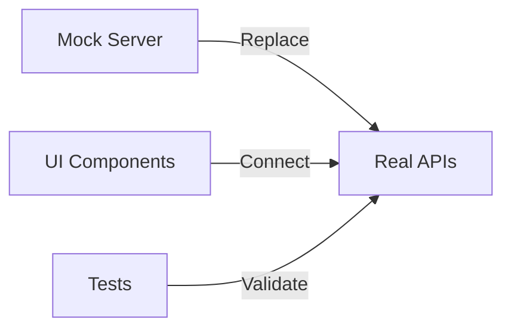

# 🚀 Plano de Execução v2.0 - Pipeline Independente

## 🎯 Mudança Fundamental: De Sequencial para Paralelo

### ❌ Modelo Antigo (Problemático)

```
Gemini cria tipos → Claude espera → Claude cria APIs → Copilot espera → Copilot cria UI
                      (BLOQUEIO)                        (BLOQUEIO)
```

### ✅ Modelo Novo (Pipeline Real)

```
FASE 0: Contrato único definido
   ↓
TODOS começam simultaneamente usando mocks
   ↓
Integração incremental conforme APIs ficam prontas
```

## 📋 FASE 0: Setup Inicial (2 horas - CRÍTICO!)

### Você (Coordenador) Executa:

```bash
# 1. Criar estrutura completa
npx create-next-app@latest home-finance-tracker --typescript --tailwind --app
cd home-finance-tracker

# 2. Instalar TODAS as dependências
npm install drizzle-orm @libsql/client bcryptjs jsonwebtoken date-fns
npm install @tanstack/react-query zustand recharts lucide-react
npm install nodemailer @telegram-bot-api/client twilio
npm install msw @mswjs/data faker

# 3. Criar estrutura de contratos
mkdir -p contracts/{api,types,database,mocks}
mkdir -p packages/{mock-server,shared-types,shared-utils}

# 4. Copiar o arquivo api-contracts-v1.md para contracts/API_CONTRACT.md
cp api-contracts-v1.md contracts/API_CONTRACT.md

# 5. Criar mock server automático
cat > packages/mock-server/server.js << 'EOF'
import { setupServer } from 'msw/node'
import { rest } from 'msw'
import contracts from '../../contracts/API_CONTRACT.md'

// Auto-gerar mocks dos contratos
const handlers = [
  rest.get('/api/v1/dashboard', (req, res, ctx) => {
    return res(ctx.json({
      cards: {
        totalLimit: 15000,
        totalUsed: 4500,
        totalAvailable: 10500,
        bestNextMonth: {
          cardId: "card_002",
          cardName: "Cartão B",
          availableCredit: 4000
        }
      }
    }))
  }),
  // ... outros endpoints dos contratos
]

export const server = setupServer(...handlers)
EOF

# 6. Criar comando para rodar mock server
cat > package.json << 'EOF'
{
  "scripts": {
    "dev": "next dev",
    "dev:mock": "MSW_ENABLED=true next dev",
    "mock-server": "node packages/mock-server/server.js"
  }
}
EOF

# 7. Git initial commit
git add .
git commit -m "[SETUP] Project with contracts and mock server ready"

# 8. Criar branches para cada agente (NOVO!)
git branch claude-backend
git branch copilot-frontend  
git branch gemini-testing

echo "✅ Setup completo! Agentes podem começar IMEDIATAMENTE em paralelo!"
```

## 🔄 NOVO FLUXO DE TRABALHO

### Cada Agente Trabalha em Sua Branch

```bash
# Claude
git checkout claude-backend
# trabalha...
git commit -m "[CLAUDE] Implemented cards API"
git push origin claude-backend

# Copilot
git checkout copilot-frontend
# trabalha...
git commit -m "[COPILOT] Dashboard components with mock data"
git push origin copilot-frontend

# Gemini
git checkout gemini-testing
# trabalha...
git commit -m "[GEMINI] Unit tests for card calculations"
git push origin gemini-testing
```

### Coordenador Faz Merge Incremental

```bash
# A cada 2 horas, integrar trabalho
git checkout main
git merge claude-backend --no-ff
git merge copilot-frontend --no-ff
git merge gemini-testing --no-ff
git push origin main

# Avisar agentes para fazer rebase
echo "Agentes: façam 'git pull origin main && git rebase main'"
```

## 📊 DIVISÃO DE TRABALHO PARALELO

### 🤖 CLAUDE (Backend) - Branch: claude-backend

#### Dia 1 - Trabalho com Mocks

```typescript
// CLAUDE PODE COMEÇAR IMEDIATAMENTE!
// 1. Implementar schema do banco baseado nos contratos
// 2. Criar APIs seguindo EXATAMENTE os contratos
// 3. Testar contra os schemas definidos

// lib/db/schema.ts
import { contracts } from '@/contracts/API_CONTRACT'
// Usar tipos do contrato, não criar novos!
```

**Tarefas Paralelas:**

- [ ] Schema do banco (SQLite/Drizzle)
- [ ] CRUD APIs básicas
- [ ] Lógica de cálculo financeiro
- [ ] Validações de entrada

**Entregáveis por Commit:**

```bash
git commit -m "[CLAUDE] Database schema matching contracts"
git commit -m "[CLAUDE] Cards API with validation"
git commit -m "[CLAUDE] Income calculation engine"
```

### 🎨 COPILOT (Frontend) - Branch: copilot-frontend

#### Dia 1 - UI com Mock Server

```typescript
// COPILOT COMEÇA IMEDIATAMENTE COM MOCKS!
// Usando MSW no browser
import { worker } from '@/mocks/browser'
if (process.env.NODE_ENV === 'development') {
  worker.start()
}

// Desenvolve TODO o UI com dados mock
const { data } = useQuery({
  queryKey: ['dashboard'],
  queryFn: () => fetch('/api/v1/dashboard').then(r => r.json())
  // Retorna mock automaticamente!
})
```

**Tarefas Paralelas:**

- [ ] Layout e navegação
- [ ] Componentes de cards
- [ ] Dashboard com gráficos
- [ ] Forms de entrada
- [ ] Feedback visual

**Entregáveis por Commit:**

```bash
git commit -m "[COPILOT] Dashboard layout with mock data"
git commit -m "[COPILOT] Card management UI complete"
git commit -m "[COPILOT] Transaction forms with validation"
```

### 🧪 GEMINI (Testing) - Branch: gemini-testing

#### Dia 1 - Testes com Contratos

```typescript
// GEMINI TESTA OS CONTRATOS, NÃO IMPLEMENTAÇÕES!
describe('API Contract Compliance', () => {
  test('Dashboard response matches contract', () => {
    const response = mockDashboardResponse
    expect(response).toMatchSchema(dashboardSchema)
  })
})

// Testes de unidade para utils
describe('Business Days Calculation', () => {
  test('considers Brazilian holidays', () => {
    const result = calculateBusinessDays('2024-11-15', 5)
    expect(result).toBe('2024-11-22') // Pula feriado 20/nov
  })
})
```

**Tarefas Paralelas:**

- [ ] Contract tests
- [ ] Unit tests para utils
- [ ] Test fixtures/factories
- [ ] Performance benchmarks
- [ ] E2E test structure

**Entregáveis por Commit:**

```bash
git commit -m "[GEMINI] Contract validation tests"
git commit -m "[GEMINI] Business logic unit tests"
git commit -m "[GEMINI] Test data factories"
```

## 🔌 INTEGRAÇÃO PROGRESSIVA

### Dia 2: Primeira Integração



#### Processo de Integração:

```bash
# 1. Coordenador verifica readiness
curl http://localhost:3000/api/v1/health
# { "claude": "ready", "database": "connected" }

# 2. Switch do mock para real
# .env.local
USE_MOCK_API=false

# 3. Rodar testes de integração
npm run test:integration

# 4. Fix incremental de issues
```

### Substituição Gradual de Mocks

```typescript
// hooks/useApi.ts
export function useApi() {
  const useMock = process.env.NEXT_PUBLIC_USE_MOCK === 'true'
  
  return {
    dashboard: useMock 
      ? () => import('@/mocks/dashboard')
      : () => fetch('/api/v1/dashboard')
  }
}
```

## 📈 MÉTRICAS DE PROGRESSO

### Dashboard de Status (Para o Coordenador)

```markdown
## Status Real-Time

### Claude (Backend)
- [ ] Database: 80% ████████░░
- [ ] APIs: 60% ██████░░░░
- [ ] Business Logic: 40% ████░░░░░░

### Copilot (Frontend)  
- [ ] Components: 70% ███████░░░
- [ ] Pages: 50% █████░░░░░
- [ ] Integration: 20% ██░░░░░░░░

### Gemini (Testing)
- [ ] Unit Tests: 60% ██████░░░░
- [ ] Integration: 30% ███░░░░░░░
- [ ] E2E: 10% █░░░░░░░░░
```

## 🎯 COMUNICAÇÃO ASSÍNCRONA

### Sistema de Mensagens no Git

```bash
# Agente precisa de algo
git commit --allow-empty -m "[COPILOT->CLAUDE] Need /api/v1/cards/{id}/transactions endpoint"

# Agente responde
git commit --allow-empty -m "[CLAUDE->COPILOT] Endpoint ready in commit abc123"

# Broadcast para todos
git commit --allow-empty -m "[ALL] Breaking change in Money type - check contracts"
```

### Health Checks Automáticos

```typescript
// api/v1/health/route.ts
export async function GET() {
  return Response.json({
    status: 'healthy',
    timestamp: new Date(),
    services: {
      database: await checkDatabase(),
      cache: await checkCache(),
      notifications: await checkNotifications()
    },
    readiness: {
      cards: true,      // API pronta
      transactions: true, // API pronta
      income: false,    // Em desenvolvimento
      alerts: false     // Não iniciado
    }
  })
}
```

## 🔒 GATES DE QUALIDADE

### Antes de Fazer Merge:

1. **Contract Compliance**
    
    ```bash
    npm run test:contracts
    # Todos os endpoints devem passar
    ```
    
2. **Type Safety**
    
    ```bash
    npm run type-check
    # Zero erros de TypeScript
    ```
    
3. **Test Coverage**
    
    ```bash
    npm run test:coverage
    # Mínimo 70% para merge
    ```
    
4. **Lint & Format**
    
    ```bash
    npm run lint:fix
    npm run format
    ```
    

## 🚨 TROUBLESHOOTING

### Problema: "Cannot find module"

```bash
# Solução: Verificar se está na branch correta
git status
git checkout main
git pull origin main
npm install
```

### Problema: "API not matching contract"

```bash
# Solução: Validar contra contrato
npm run validate:api -- --endpoint=/api/v1/cards
```

### Problema: "Merge conflicts"

```bash
# Solução: Coordenador resolve
git checkout main
git merge --strategy=ours claude-backend
# Revisar manualmente
```

## ✅ DEFINITION OF DONE

### Para cada Feature:

- [ ] Implementado conforme contrato
- [ ] Testes escritos e passando
- [ ] Documentação atualizada
- [ ] Code review pelo coordenador
- [ ] Merge sem conflitos
- [ ] Health check verde

## 🎉 BENEFÍCIOS DO NOVO MODELO

1. **Zero Bloqueios**: Ninguém espera ninguém
2. **Desenvolvimento Paralelo Real**: 3x mais rápido
3. **Feedback Contínuo**: Integração a cada 2 horas
4. **Qualidade Garantida**: Contratos previnem bugs
5. **Rollback Fácil**: Branches isoladas
6. **Visibilidade Total**: Health checks e métricas

## 📅 TIMELINE OTIMIZADO

```
Dia 0 (2h): Setup + Contracts
Dia 1: Desenvolvimento paralelo (todos)
Dia 2 AM: Primeira integração
Dia 2 PM: Ajustes e segunda wave
Dia 3 AM: Features avançadas
Dia 3 PM: Polish e otimização
Dia 4: Testes finais e deploy
```

**RESULTADO: 4 dias ao invés de 6, com maior qualidade!**