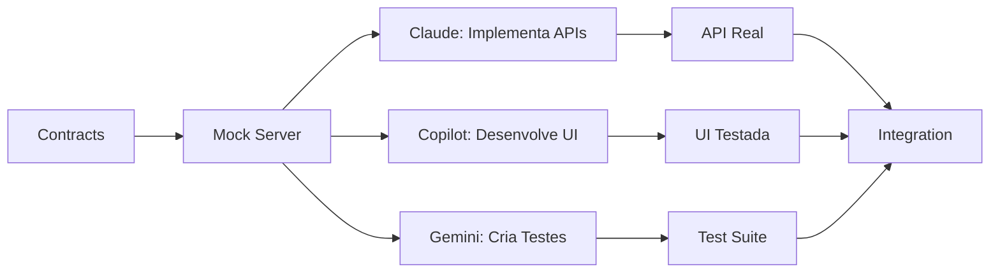

# 🔍 Análise Crítica e Melhorias - Home Finance Tracker

## 🚨 Problemas Críticos Identificados

### 1. FALHAS NA LÓGICA FINANCEIRA

#### ❌ Problemas Atuais:

**1.1 Cálculo de Dias Úteis Incompleto**

- Não considera feriados bancários brasileiros
- Não diferencia feriados nacionais vs bancários
- StartPlaying: E se o 5º dia útil cai no fim de semana?

**1.2 Gestão de Parcelas Deficiente**

```
CENÁRIO PROBLEMÁTICO:
- Compra de R$ 1200 em 12x no Cartão A (limite R$ 2000)
- Parcela mensal: R$ 100
- Sistema não projeta que R$ 100 já estão comprometidos pelos próximos 11 meses
- Usuário pode achar que tem R$ 1900 disponíveis, mas na verdade tem R$ 1800
```

**1.3 Múltiplas Contas Bancárias Ignoradas**

- Dinheiro do RPG vai para qual conta?
- Como transferir entre contas?
- Saldo total vs saldo por conta

**1.4 Impostos e Taxas Não Considerados**

- IR sobre receitas internacionais (carnê-leão)
- IOF em transações internacionais
- Taxas de transferência bancária

**1.5 Recorrência de RPG Mal Definida**

```
QUESTÕES NÃO RESPONDIDAS:
- Mesa cancela no mês - como ajustar?
- Jogador sai/entra - como recalcular?
- Sessão extra - como adicionar?
- Férias do mestre - como pausar?
```

### 2. PROBLEMAS DE ARQUITETURA E PIPELINE

#### ❌ Acoplamento Excessivo Entre Agentes

**Problema Atual:**

```
Gemini (tipos) → Claude (API) → Copilot (UI)
                    ↑
                    └── GARGALO: Copilot para totalmente
```

**Solução: Pipeline Verdadeiramente Assíncrona**

```
Gemini: Contratos → Mock Server → Todos desenvolvem em paralelo
           ↓            ↓
        Claude       Copilot
      (implementa)  (usa mocks)
```

#### ❌ Falta de Contratos de API

**Problema:** Cada agente descobre as APIs "no escuro"

**Solução: API-First Design**

```yaml
# /contracts/api/cards.yaml
endpoints:
  - path: /api/cards
    method: POST
    request:
      body:
        name: string
        limit: number
        dueDate: number
    response:
      201:
        id: string
        name: string
        availableCredit: number
    examples:
      request: { name: "Cartão A", limit: 5000, dueDate: 5 }
      response: { id: "c1", name: "Cartão A", availableCredit: 5000 }
```

### 3. FUNCIONALIDADES CRÍTICAS AUSENTES

#### 🔴 Falta Sistema de Orçamentos

```typescript
interface Budget {
  category: 'alimentação' | 'transporte' | 'lazer' | 'rpg'
  monthly_limit: number
  current_spent: number
  alert_threshold: 0.8 // alerta em 80%
}
```

#### 🔴 Falta Reconciliação Bancária

- Como confirmar que o pagamento do RPG chegou?
- Como marcar transação como "compensada"?
- E se o valor recebido for diferente do esperado?

#### 🔴 Falta Modo Multi-Usuário/Família

- Esposa precisa ver/adicionar transações
- Contas compartilhadas vs individuais
- Permissões diferenciadas

#### 🔴 Falta Histórico e Análise

- Comparativo mês a mês
- Tendências de gastos
- Previsão baseada em histórico

### 4. PROBLEMAS ESPECÍFICOS POR AGENTE

#### Claude Code - Backend

**Problemas:**

- ❌ Não define estratégia de cache
- ❌ Não especifica tratamento de concorrência
- ❌ Não tem rate limiting
- ❌ Não versiona APIs
- ❌ Não tem health checks

**Melhorias Necessárias:**

```typescript
// Versionamento de API
/api/v1/cards
/api/v1/transactions

// Health check
/api/health → { status: 'ok', db: 'connected', version: '1.0.0' }

// Cache strategy
@Cache({ ttl: 300 }) // 5 minutos
getDashboardSummary()
```

#### GitHub Copilot - Frontend

**Problemas:**

- ❌ Não tem estratégia offline-first
- ❌ Não define error boundaries
- ❌ Componentes muito acoplados
- ❌ Não tem storybook para desenvolvimento isolado

**Melhorias Necessárias:**

```typescript
// MSW para mocks
setupWorker(
  rest.get('/api/cards', (req, res, ctx) => {
    return res(ctx.json(mockCards))
  })
)

// Error Boundary
<ErrorBoundary fallback={<ErrorFallback />}>
  <Dashboard />
</ErrorBoundary>
```

#### Gemini CLI - Testing

**Problemas:**

- ❌ Tipos definidos muito tarde
- ❌ Não tem testes de contrato
- ❌ Não valida schemas de API
- ❌ Não tem smoke tests

**Melhorias Necessárias:**

```typescript
// Contract testing
describe('API Contracts', () => {
  test('POST /api/cards matches contract', async () => {
    const response = await request.post('/api/cards')
    expect(response).toMatchSchema(cardSchema)
  })
})
```

## 🎯 PROPOSTA DE REESTRUTURAÇÃO

### FASE 0: Contratos e Mocks (Dia 0 - 4 horas)

#### Novo Agente Temporário: "Architect"

```markdown
MISSÃO: Definir TODOS os contratos antes de começar

Outputs:
1. /contracts/api/*.yaml - Todos os endpoints
2. /contracts/types/*.ts - Todos os tipos
3. /contracts/database/*.sql - Schema completo
4. /mocks/api/*.json - Responses de exemplo
5. /docs/business-rules.md - Regras de negócio
```

### FASE 1: Pipeline Paralela Real



### Nova Estrutura de Diretórios

```
/contracts           # NOVO: Compartilhado, read-only para todos
  /api              # OpenAPI specs
  /types            # TypeScript types
  /database         # SQL schemas
  /mocks            # Mock responses

/services           # NOVO: Microserviços
  /cards-service    # Claude
  /income-service   # Claude
  /alerts-service   # Claude
  
/packages          # NOVO: Monorepo packages
  /ui-components    # Copilot
  /shared-utils     # Gemini
  /test-helpers     # Gemini
```

## 📋 REGRAS DE NEGÓCIO CORRIGIDAS

### 1. Cálculo de Parcelas Futuras

```typescript
interface CreditCard {
  limit: number
  current_balance: number
  future_installments: {
    month: string // "2024-11"
    amount: number // soma das parcelas neste mês
  }[]
  
  // NOVO: Crédito realmente disponível
  get true_available_credit() {
    return this.limit - this.current_balance - this.total_future_installments
  }
}
```

### 2. Gestão de Receitas RPG

```typescript
interface RPGSession {
  // Configuração base
  base_config: {
    type: 'national' | 'international'
    regular_players: number
    session_price: number
    payment_method: 'pix' | 'direct_transfer' | 'startplaying'
  }
  
  // Exceções do mês
  month_exceptions: {
    cancelled_dates: Date[]
    extra_sessions: Date[]
    player_changes: { date: Date, players: number }[]
  }
  
  // Cálculo final
  calculate_month_total(): {
    expected_amount: number
    expected_date: Date
    confidence: 'confirmed' | 'probable' | 'tentative'
  }
}
```

### 3. Sistema de Alertas Inteligentes

```typescript
interface SmartAlert {
  // Níveis progressivos
  levels: {
    info: 'FYI - Fatura fecha em 3 dias'
    warning: 'Atenção - 80% do limite usado'
    critical: 'URGENTE - Limite excedido, pagamento RPG atrasado'
    resolved: 'Resolvido - Pagamento recebido'
  }
  
  // Agrupamento inteligente
  batch_alerts(): Alert[] // Agrupa múltiplos alertas em um só
  
  // Timing inteligente
  schedule: {
    immediate: ['limit_exceeded', 'payment_failed']
    daily_summary: ['upcoming_bills', 'pending_income']
    weekly: ['budget_report', 'savings_progress']
  }
}
```

### 4. Multi-Currency Handling

```typescript
interface ExchangeRate {
  source_currency: 'USD' | 'GBP' | 'EUR'
  target_currency: 'BRL'
  rate: number
  date: Date // Taxa do dia
  source: 'manual' | 'api' | 'bank_statement'
  
  // Histórico para impostos
  store_for_tax_purposes: boolean
  effective_rate_after_fees: number
}
```

## 🚀 NOVO PLANO DE EXECUÇÃO

### DIA 0 (4 horas) - Definição

1. Criar TODOS os contratos de API
2. Definir TODOS os tipos TypeScript
3. Criar mock server com MSW
4. Documentar regras de negócio

### DIA 1 - Desenvolvimento Paralelo

- **Claude:** Implementa APIs usando contratos
- **Copilot:** Desenvolve UI usando mocks
- **Gemini:** Cria testes contra contratos

### DIA 2 - Integração

- Substituir mocks por APIs reais
- Rodar testes de integração
- Ajustar inconsistências

### DIA 3 - Features Avançadas

- Sistema de notificações
- Dashboard analytics
- Cálculos complexos RPG

### DIA 4 - Polish & Deploy

- Performance optimization
- Error handling
- Deployment setup

## 🔐 NOVOS REQUISITOS DE SEGURANÇA

```typescript
// Autenticação multi-fator para transações críticas
interface SecurityRequirement {
  mfa_required_for: [
    'delete_card',
    'modify_recurring_income',
    'export_tax_data'
  ]
  
  encryption: {
    at_rest: 'AES-256'
    in_transit: 'HTTPS only'
    sensitive_fields: ['card_numbers', 'bank_accounts']
  }
  
  audit_log: {
    track: ['all_transactions', 'setting_changes']
    retention: '7 years' // requisito fiscal
  }
}
```

## ✅ CHECKLIST DE CORREÇÕES URGENTES

### Lógica Financeira

- [ ] Adicionar cálculo de feriados brasileiros
- [ ] Implementar parcelas futuras comprometidas
- [ ] Adicionar múltiplas contas bancárias
- [ ] Calcular impostos sobre receitas internacionais
- [ ] Criar reconciliação bancária

### Arquitetura

- [ ] Criar contratos de API primeiro
- [ ] Implementar mock server
- [ ] Adicionar versionamento de API
- [ ] Criar health checks
- [ ] Implementar cache strategy

### Features

- [ ] Sistema de orçamentos
- [ ] Modo família/multi-usuário
- [ ] Histórico e análises
- [ ] Backup automático
- [ ] Modo offline

### Segurança

- [ ] Autenticação robusta
- [ ] Criptografia de dados sensíveis
- [ ] Audit logging
- [ ] Rate limiting

## 💡 CONCLUSÃO

O sistema atual tem potencial mas precisa de:

1. **Definição clara de contratos** antes de começar
2. **Verdadeira independência** entre agentes via mocks
3. **Lógica financeira mais robusta** com casos edge
4. **Features essenciais** como orçamento e multi-usuário
5. **Segurança** desde o início, não depois

Com essas correções, o sistema será verdadeiramente profissional e escalável!