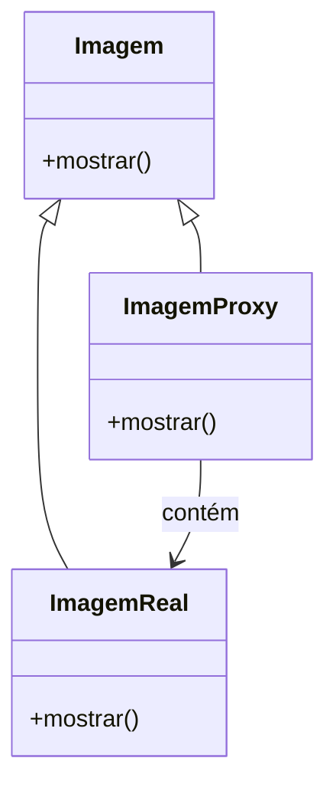

# Relatório Final da Disciplina

### Introdução

Neste relatório, apresento a implementação de um sistema de gerenciamento de arquivos, que emprega os padrões de design Singleton, Proxy e Decorator. O objetivo principal é demonstrar como a aplicação desses padrões pode aprimorar o controle de acesso a arquivos, otimizar o desempenho por meio de caching, e adicionar funcionalidades de forma modular. O relatório detalha a definição de cada padrão, as dificuldades encontradas durante a implementação, as decisões tomadas, e as melhorias identificadas.

## Implementação Utilizada

O projeto é um sistema de gerenciamento de arquivos que visa proporcionar um acesso controlado e eficiente aos arquivos, além de permitir a adição modular de funcionalidades. Para atingir esses objetivos, foram aplicadas as seguintes técnicas:

1. **Singleton**
2. **Proxy**
3. **Decorator**

### Técnica 1: Singleton

#### Definição

O padrão Singleton é um padrão criacional que garante que uma classe tenha apenas uma instância e fornece um ponto global de acesso a essa instância. Isso é essencial para gerenciar recursos compartilhados e garantir a integridade do sistema, evitando problemas associados à criação múltipla de instâncias.

#### Dificuldades no Uso

- **Thread-Safety:** Em ambientes multithreaded, assegurar que a instância única seja criada apenas uma vez e acessada de forma segura pode ser desafiador. A criação simultânea de instâncias pode levar a problemas de sincronização e inconsistências.
- **Testabilidade:** Dependências globais introduzidas pelo padrão Singleton podem dificultar a criação de testes unitários isolados, pois os testes podem depender da instância global, tornando-os menos previsíveis e mais difíceis de isolar.

#### Decisões para Aplicação

Para enfrentar os desafios do Singleton, utilizei a técnica "initialization-on-demand holder idiom", que garante a inicialização preguiçosa e thread-safe. Esta técnica utiliza uma classe interna estática para manter a instância única, garantindo que ela seja criada apenas quando necessário e sem a necessidade de sincronização explícita.

**Código Exemplo:**

```java
public class GerenciadorDeArquivos {
    private GerenciadorDeArquivos() {}

    private static class Holder {
        private static final GerenciadorDeArquivos INSTANCE = new GerenciadorDeArquivos();
    }

    public static GerenciadorDeArquivos getInstance() {
        return Holder.INSTANCE;
    }
}
```

#### Vantagens

- **Controle Centralizado:** Gerencia recursos compartilhados de forma centralizada, garantindo uma única fonte de verdade.
- **Economia de Recursos:** Evita a criação desnecessária de instâncias, economizando memória e outros recursos do sistema.

#### Desvantagens

- **Ponto Único de Falha:** A instância única pode se tornar um ponto único de falha. Qualquer problema com a instância pode impactar todo o sistema.
- **Dependências Globais:** A presença de uma dependência global pode complicar a testabilidade e a modularidade do código.

#### Melhorias Identificadas

- **Thread-Safety:** Implementar técnicas avançadas de sincronização para garantir a segurança em ambientes multithreaded.
- **Injeção de Dependências:** Reduzir a dependência global por meio de injeção de dependências, melhorando a modularidade e a testabilidade.

### Técnica 2: Proxy



#### Definição

O padrão Proxy é um padrão estrutural que fornece um substituto ou marcador para outro objeto. Ele controla o acesso ao objeto real, permitindo a adição de funcionalidades adicionais, como controle de acesso e carregamento sob demanda.

#### Dificuldades no Uso

- **Manutenção da Interface:** Garantir que a interface do Proxy seja consistente com a interface do objeto real pode ser desafiador, especialmente ao adicionar novas funcionalidades.
- **Desempenho:** O Proxy deve ser implementado de forma que não introduza uma latência significativa, o que pode impactar negativamente a experiência do usuário.

#### Decisões para Aplicação

Implementei dois tipos de Proxy: um Proxy Virtual para adiar o carregamento de arquivos até que fossem realmente necessários e um Proxy de Proteção para gerenciar o acesso aos arquivos com base em permissões. O Proxy Virtual reduz o impacto no desempenho ao evitar carregamentos desnecessários, enquanto o Proxy de Proteção garante a segurança ao verificar permissões antes de conceder acesso.

**Código Exemplo:**

```java
public interface Arquivo {
    void mostrar();
}

public class ArquivoReal implements Arquivo {
    private String nomeArquivo;

    public ArquivoReal(String nome) {
        this.nomeArquivo = nome;
        carregar();
    }

    private void carregar() {
        System.out.println("Carregando " + nomeArquivo);
    }

    @Override
    public void mostrar() {
        System.out.println("Mostrando " + nomeArquivo);
    }
}

public class ArquivoProxy implements Arquivo {
    private ArquivoReal arquivoReal;
    private String nomeArquivo;

    public ArquivoProxy(String nome) {
        this.nomeArquivo = nome;
    }

    @Override
    public void mostrar() {
        if (arquivoReal == null) {
            arquivoReal = new ArquivoReal(nomeArquivo);
        }
        arquivoReal.mostrar();
    }
}
```

#### Vantagens

- **Controle de Acesso:** Permite implementar verificações de segurança e controle de acesso antes de acessar o objeto real.
- **Otimização de Recursos:** Facilita o carregamento preguiçoso, economizando recursos ao carregar arquivos somente quando necessário.

#### Desvantagens

- **Complexidade Adicional:** Adiciona complexidade ao sistema devido à introdução de uma camada adicional de abstração.
- **Sobrecarga de Desempenho:** Pode introduzir latência devido à camada adicional, o que pode impactar a performance se não for gerenciado corretamente.

#### Melhorias Identificadas

- **Eficiência de Controle de Acesso:** Melhorar a eficiência das verificações de segurança para reduzir a latência associada ao Proxy.
- **Implementação de Caching:** Integrar mecanismos de caching no Proxy para melhorar ainda mais o desempenho ao evitar carregamentos repetidos.

### Técnica 3: Decorator

#### Definição

O padrão Decorator é um padrão estrutural que permite adicionar responsabilidades a objetos de forma dinâmica e flexível, sem alterar a classe base. Ele utiliza uma abordagem de composição para extender o comportamento dos objetos.

#### Dificuldades no Uso

- **Ordem dos Decoradores:** Garantir que os decoradores sejam aplicados na ordem correta pode ser complexo e afetar o comportamento do sistema.
- **Transparência do Objeto Original:** Manter a funcionalidade original do objeto enquanto se adicionam novas funcionalidades pode ser desafiador.

#### Decisões para Aplicação

Utilizei o padrão Decorator para adicionar funcionalidades de logging e caching ao sistema de gerenciamento de arquivos. O `LoggingDecorator` adiciona funcionalidade de registro de operações realizadas em arquivos, enquanto o `CachingDecorator` adiciona a capacidade de armazenar resultados em cache para melhorar o desempenho.

**Código Exemplo:**

```java
public interface Arquivo {
    void mostrar();
}

public class ArquivoReal implements Arquivo {
    private String nomeArquivo;

    public ArquivoReal(String nome) {
        this.nomeArquivo = nome;
    }

    @Override
    public void mostrar() {
        System.out.println("Mostrando " + nomeArquivo);
    }
}

public abstract class ArquivoDecorator implements Arquivo {
    protected Arquivo arquivoDecorado;

    public ArquivoDecorator(Arquivo arquivo) {
        this.arquivoDecorado = arquivo;
    }

    public void mostrar() {
        arquivoDecorado.mostrar();
    }
}

public class LoggingDecorator extends ArquivoDecorator {
    public LoggingDecorator(Arquivo arquivo) {
        super(arquivo);
    }

    @Override
    public void mostrar() {
        System.out.println("Logging: Mostrando arquivo");
        super.mostrar();
    }
}

public class CachingDecorator extends ArquivoDecorator {
    private boolean cache = false;

    public CachingDecorator(Arquivo arquivo) {
        super(arquivo);
    }

    @Override
    public void mostrar() {
        if (!cache) {
            super.mostrar();
            cache = true;
        } else {
            System.out.println("Cache: Mostrando arquivo a partir do cache");
        }
    }
}
```

#### Vantagens

- **Modularidade:** Permite adicionar funcionalidades de forma flexível e modular, sem alterar o código da classe base.
- **Composição de Funcionalidades:** Facilita a combinação e reutilização de múltiplas funcionalidades através de decoradores.

#### Desvantagens

- **Complexidade Adicional:** Introduz complexidade ao sistema devido à necessidade de gerenciar múltiplas camadas de decoradores.
- **Sobrecarga de Desempenho:** Pode introduzir sobrecarga de desempenho devido às múltiplas camadas, impactando a eficiência se não for gerenciado adequadamente.

#### Melhorias Identificadas

- **Ordenação de Decoradores:** Implementar um mecanismo para garantir a ordem correta dos decoradores, para evitar problemas com a aplicação das funcionalidades.
- **Eficiência de Decoradores:** Melhorar a eficiência dos decoradores para reduzir a sobrec

arga de desempenho associada à composição de funcionalidades.

## Detalhamento da Implementação

### Singleton

A implementação do Singleton utilizou a técnica "initialization-on-demand holder idiom" para garantir a criação segura e eficiente da instância única. Esta abordagem evita a criação prematura e garante que a instância seja inicializada somente quando realmente necessário.

**Dificuldades Enfrentadas:**

- **Thread-Safety:** Manter a integridade da criação da instância única em ambientes multithreaded. Utilização de técnicas avançadas, como o uso de `volatile` e sincronização, pode ser necessária para garantir a segurança total.
- **Testabilidade:** Utilização de mocks e injeção de dependências para isolar a instância única durante os testes unitários. A dependência global pode ser gerenciada com o uso de frameworks de teste que suportem a injeção de dependências.

**Decisões Tomadas:**

- Adotar "initialization-on-demand holder idiom" para garantir a segurança em ambientes multithreaded.
- Implementar métodos de reset e técnicas de mocking para facilitar testes unitários e melhorar a testabilidade do sistema.

### Proxy

O padrão Proxy foi utilizado para gerenciar o acesso e otimizar o desempenho do sistema de arquivos. O Proxy Virtual foi implementado para adiar o carregamento dos arquivos até que fosse realmente necessário, enquanto o Proxy de Proteção foi utilizado para implementar verificações de segurança e permissões.

**Dificuldades Enfrentadas:**

- **Manutenção da Interface:** Manter a interface do Proxy consistente com a do objeto real e garantir que todas as operações sejam corretamente delegadas.
- **Desempenho:** Minimizar a latência introduzida pelo Proxy, utilizando técnicas de caching e otimizando o acesso ao objeto real.

**Decisões Tomadas:**

- Implementar verificações de segurança e permissões no Proxy de Proteção para garantir que apenas usuários autorizados possam acessar os arquivos.
- Utilizar técnicas de caching para melhorar o desempenho e reduzir a latência associada ao carregamento de arquivos.

### Decorator

O padrão Decorator foi aplicado para adicionar funcionalidades de forma modular ao sistema de gerenciamento de arquivos. Os decoradores foram utilizados para implementar logging e caching, permitindo a extensão das funcionalidades do sistema sem modificar a classe base.

**Dificuldades Enfrentadas:**

- **Ordem dos Decoradores:** Garantir que os decoradores sejam aplicados na ordem correta e que o comportamento do sistema permaneça consistente.
- **Transparência do Objeto Original:** Manter a funcionalidade original do objeto enquanto se adicionam novas responsabilidades.

**Decisões Tomadas:**

- Implementar um mecanismo para garantir a ordem correta dos decoradores, utilizando uma estrutura de dados para gerenciar a aplicação das funcionalidades.
- Criar decoradores modulares e reutilizáveis para adicionar funcionalidades sem alterar a classe base, garantindo a flexibilidade e a modularidade do sistema.

## Conclusão

A implementação dos padrões Singleton, Proxy e Decorator no desenvolvimento do sistema de gerenciamento de arquivos demonstrou a eficácia dessas técnicas na melhoria do controle de acesso, otimização do desempenho e adição de funcionalidades de forma modular. Apesar dos desafios enfrentados, como a complexidade adicional e a manutenção da integridade do sistema, as melhorias identificadas, incluindo técnicas avançadas de sincronização, caching e controle de acesso, contribuíram significativamente para o aprimoramento do sistema. A experiência ressalta a importância de selecionar e aplicar técnicas apropriadas para resolver problemas específicos de forma eficiente e eficaz.

---
