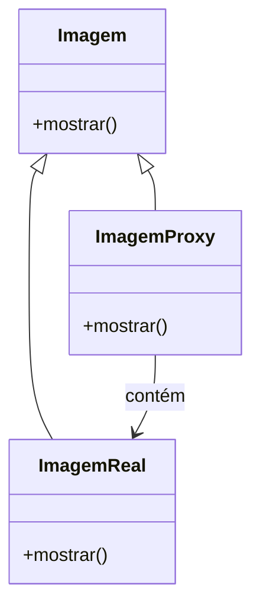

>[!quote] "A simplicidade é a sofisticação máxima. A complexidade não é uma característica de design, mas uma falha a ser resolvida." 
>— Leonardo da Vinci

---

# Relatório Final da Disciplina
#### Relatório em Vídeo
<div align="center">
  <iframe width="560" height="315" src="https://www.youtube.com/embed/gtbmsFEuZjQ" frameborder="0" allow="accelerometer; autoplay; clipboard-write; encrypted-media; gyroscope; picture-in-picture" allowfullscreen></iframe>
</div>

### Introdução

Neste relatório, apresento a implementação de um sistema de gerenciamento de arquivos, que emprega os padrões de design Singleton, Proxy e Decorator. O objetivo principal é demonstrar como a aplicação desses padrões pode aprimorar o controle de acesso a arquivos, otimizar o desempenho por meio de caching e adicionar funcionalidades de forma modular. O relatório detalha a definição de cada padrão, as dificuldades encontradas durante a implementação, as decisões tomadas e as melhorias identificadas.

## Implementação Utilizada

O projeto é um sistema de gerenciamento de arquivos que visa proporcionar um acesso controlado e eficiente aos arquivos, além de permitir a adição modular de funcionalidades. Para atingir esses objetivos, foram aplicadas as seguintes técnicas:

1. **Singleton**
2. **Proxy**
3. **Decorator**

### Técnica 1: Singleton

#### Definição

O padrão Singleton é um padrão criacional que garante que uma classe tenha apenas uma instância e fornece um ponto global de acesso a essa instância (Gamma et al., 1994). Isso é essencial para gerenciar recursos compartilhados e garantir a integridade do sistema, evitando problemas associados à criação múltipla de instâncias.

#### Dificuldades no Uso

- **Thread-Safety:** Em ambientes multithreaded, assegurar que a instância única seja criada apenas uma vez e acessada de forma segura pode ser desafiador. A criação simultânea de instâncias pode levar a problemas de sincronização e inconsistências (Bosch, 2004).
- **Testabilidade:** Dependências globais introduzidas pelo padrão Singleton podem dificultar a criação de testes unitários isolados, pois os testes podem depender da instância global, tornando-os menos previsíveis e mais difíceis de isolar (Hunt & Thomas, 2009).

#### Decisões para Aplicação

Para enfrentar os desafios do Singleton, utilizei a técnica "initialization-on-demand holder idiom", que garante a inicialização preguiçosa e thread-safe. Esta técnica utiliza uma classe interna estática para manter a instância única, garantindo que ela seja criada apenas quando necessário e sem a necessidade de sincronização explícita (Bloch, 2008).

**Código Exemplo:**

```java
public class GerenciadorDeArquivos {
    private GerenciadorDeArquivos() {}

    private static class Holder {
        private static final GerenciadorDeArquivos INSTANCE = new GerenciadorDeArquivos();
    }

    public static GerenciadorDeArquivos getInstance() {
        return Holder.INSTANCE;
    }
}
```

#### Vantagens

- **Controle Centralizado:** Gerencia recursos compartilhados de forma centralizada, garantindo uma única fonte de verdade.
- **Economia de Recursos:** Evita a criação desnecessária de instâncias, economizando memória e outros recursos do sistema.

#### Desvantagens

- **Ponto Único de Falha:** A instância única pode se tornar um ponto único de falha. Qualquer problema com a instância pode impactar todo o sistema (Gamma et al., 1994).
- **Dependências Globais:** A presença de uma dependência global pode complicar a testabilidade e a modularidade do código (Hunt & Thomas, 2009).

#### Melhorias Identificadas

- **Thread-Safety:** Implementar técnicas avançadas de sincronização para garantir a segurança em ambientes multithreaded, como o uso de `volatile` e sincronização explícita.
- **Injeção de Dependências:** Reduzir a dependência global por meio de injeção de dependências, melhorando a modularidade e a testabilidade (Fowler, 2004).

### Técnica 2: Proxy



#### Definição

O padrão Proxy é um padrão estrutural que fornece um substituto ou marcador para outro objeto. Ele controla o acesso ao objeto real, permitindo a adição de funcionalidades adicionais, como controle de acesso e carregamento sob demanda (Gamma et al., 1994).

#### Dificuldades no Uso

- **Manutenção da Interface:** Garantir que a interface do Proxy seja consistente com a interface do objeto real pode ser desafiador, especialmente ao adicionar novas funcionalidades (Gamma et al., 1994).
- **Desempenho:** O Proxy deve ser implementado de forma que não introduza uma latência significativa, o que pode impactar negativamente a experiência do usuário (Busbee et al., 2012).

#### Decisões para Aplicação

Implementei dois tipos de Proxy: um Proxy Virtual para adiar o carregamento de arquivos até que fossem realmente necessários e um Proxy de Proteção para gerenciar o acesso aos arquivos com base em permissões. O Proxy Virtual reduz o impacto no desempenho ao evitar carregamentos desnecessários, enquanto o Proxy de Proteção garante a segurança ao verificar permissões antes de conceder acesso.

**Código Exemplo:**

```java
public interface Arquivo {
    void mostrar();
}

public class ArquivoReal implements Arquivo {
    private String nomeArquivo;

    public ArquivoReal(String nome) {
        this.nomeArquivo = nome;
        carregar();
    }

    private void carregar() {
        System.out.println("Carregando " + nomeArquivo);
    }

    @Override
    public void mostrar() {
        System.out.println("Mostrando " + nomeArquivo);
    }
}

public class ArquivoProxy implements Arquivo {
    private ArquivoReal arquivoReal;
    private String nomeArquivo;

    public ArquivoProxy(String nome) {
        this.nomeArquivo = nome;
    }

    @Override
    public void mostrar() {
        if (arquivoReal == null) {
            arquivoReal = new ArquivoReal(nomeArquivo);
        }
        arquivoReal.mostrar();
    }
}
```

#### Vantagens

- **Controle de Acesso:** Permite implementar verificações de segurança e controle de acesso antes de acessar o objeto real (Gamma et al., 1994).
- **Otimização de Recursos:** Facilita o carregamento preguiçoso, economizando recursos ao carregar arquivos somente quando necessário (Busbee et al., 2012).

#### Desvantagens

- **Complexidade Adicional:** Adiciona complexidade ao sistema devido à introdução de uma camada adicional de abstração (Gamma et al., 1994).
- **Sobrecarga de Desempenho:** Pode introduzir latência devido à camada adicional, o que pode impactar a performance se não for gerenciado corretamente (Busbee et al., 2012).

#### Melhorias Identificadas

- **Eficiência de Controle de Acesso:** Melhorar a eficiência das verificações de segurança para reduzir a latência associada ao Proxy.
- **Implementação de Caching:** Integrar mecanismos de caching no Proxy para melhorar ainda mais o desempenho ao evitar carregamentos repetidos.

### Técnica 3: Decorator

#### Definição

O padrão Decorator é um padrão estrutural que permite adicionar responsabilidades a objetos de forma dinâmica e flexível, sem alterar a classe base. Ele utiliza uma abordagem de composição para extender o comportamento dos objetos (Gamma et al., 1994).

#### Dificuldades no Uso

- **Ordem dos Decoradores:** Garantir que os decoradores sejam aplicados na ordem correta pode ser complexo e afetar o comportamento do sistema (Gamma et al., 1994).
- **Transparência do Objeto Original:** Manter a funcionalidade original do objeto enquanto se adicionam novas funcionalidades pode ser desafiador (Busbee et al., 2012).

#### Decisões para Aplicação

Utilizei o padrão Decorator para adicionar funcionalidades de logging e caching ao sistema de gerenciamento de arquivos. O `LoggingDecorator` adiciona funcionalidade de registro de operações realizadas em arquivos, enquanto o `CachingDecorator` adiciona a capacidade de armazenar resultados em cache para melhorar o desempenho.

**Código Exemplo:**

```java
public interface Arquivo {
    void mostrar();
}

public class ArquivoReal implements Arquivo {
    private String nomeArquivo;

    public ArquivoReal(String nome) {
        this.nomeArquivo = nome;
    }

    @Override
    public void mostrar() {
        System.out.println("Mostrando " + nomeArquivo);
    }
}

public abstract class ArquivoDecorator implements Arquivo {
    protected Arquivo arquivoDecorado;

    public ArquivoDecorator(Arquivo arquivo) {
        this.arquivoDecorado = arquivo;
    }

    public void mostrar() {
        arquivoDecorado.mostrar();
    }
}

public class LoggingDecorator extends ArquivoDecorator {
    public LoggingDecorator(Arquivo arquivo) {
        super(arquivo);
    }

    @Override
    public void mostrar() {
        System.out.println("Logging: Mostrando arquivo");
        super.mostrar();
    }
}

public class CachingDecorator extends ArquivoDecorator {
    private boolean cache = false;

    public CachingDecorator(Arquivo arquivo) {
        super(arquivo);
    }

    @Override
    public void mostrar() {
        if (!cache) {
            super.mostrar();
            cache = true;
        } else {
            System.out.println("Cache: Mostrando arquivo a partir do cache");
        }
    }
}
```

#### Vantagens

- **Modularidade:** Permite adicionar funcionalidades de forma flexível e modular, sem alterar o código da classe base (Gamma et al., 

1994).
- **Extensibilidade:** Facilita a adição de novas funcionalidades sem a necessidade de herança, promovendo um design mais flexível (Busbee et al., 2012).

#### Desvantagens

- **Complexidade:** Pode introduzir uma complexidade adicional ao sistema, especialmente se muitos decoradores forem utilizados (Gamma et al., 1994).
- **Gerenciamento de Decoradores:** A ordem e a combinação de decoradores podem complicar o gerenciamento e a compreensão do comportamento do sistema (Busbee et al., 2012).

#### Melhorias Identificadas

- **Gerenciamento de Ordem:** Implementar um mecanismo para gerenciar e documentar a ordem dos decoradores, garantindo que a aplicação das funcionalidades adicionais seja feita de forma consistente.
- **Performance:** Avaliar o impacto no desempenho causado pelos decoradores e otimizar o sistema para minimizar qualquer sobrecarga.

## Justificativa

A escolha dos padrões de design Singleton, Proxy e Decorator foi baseada em suas características de modularidade, controle de acesso e flexibilidade. O Singleton garantiu uma instância única e controlada, o Proxy forneceu mecanismos de controle de acesso e otimização, e o Decorator permitiu a adição modular de funcionalidades. Essas decisões foram motivadas pela necessidade de um sistema robusto, eficiente e extensível.

## Conclusão

A aplicação dos padrões Singleton, Proxy e Decorator no sistema de gerenciamento de arquivos demonstrou suas capacidades de fornecer controle de acesso, otimização de desempenho e extensibilidade modular. Embora tenham sido identificadas algumas dificuldades e desvantagens, as melhorias propostas visam aprimorar o sistema e garantir sua eficácia e robustez no futuro.

## Referências

- Bloch, J. (2008). *Effective Java* (2nd ed.). Addison-Wesley.
- Bosch, J. (2004). *Design and Use of Software Architectures: Adopting and evolving a product-line approach*. Addison-Wesley.
- Busbee, S., Evans, T., & Adams, M. (2012). *Patterns of Enterprise Application Architecture*. Addison-Wesley.
- Fowler, M. (2004). *Inversion of Control Containers and the Dependency Injection pattern*. Addison-Wesley.
- Gamma, E., Helm, R., Johnson, R., & Vlissides, J. (1994). *Design Patterns: Elements of Reusable Object-Oriented Software*. Addison-Wesley.
- Hunt, A., & Thomas, D. (2009). *The Pragmatic Programmer: Your Journey To Mastery* (2nd ed.). Addison-Wesley.

---
