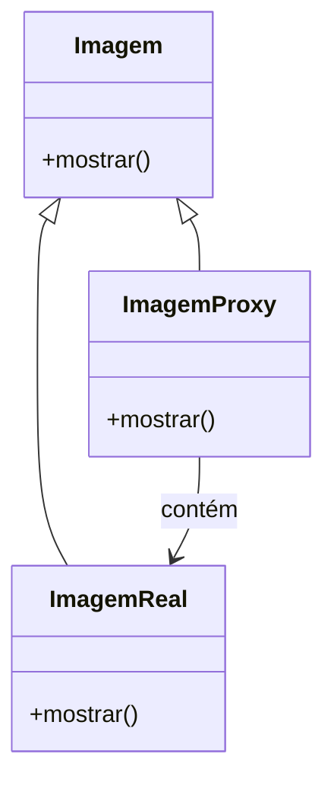
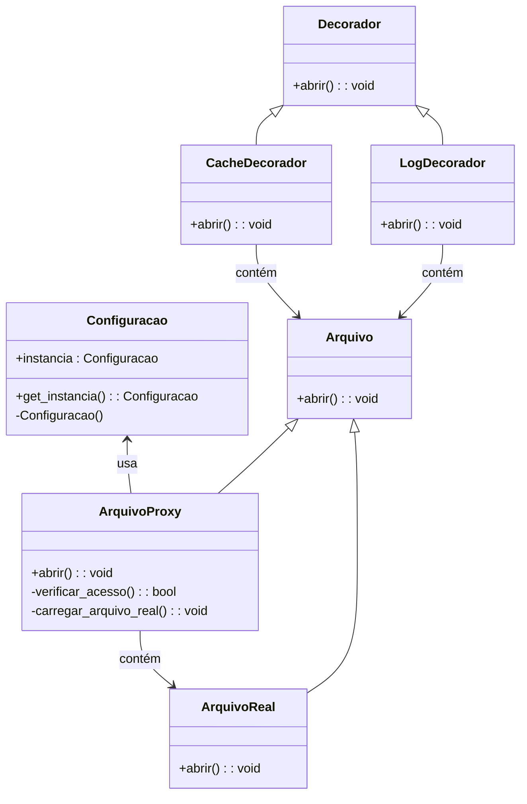

> [!quote] The truth you believe and cling to makes you unavailable to hear anything new.
> — Pema Chödrön


# Relatório Final da Disciplina

## Introdução

Neste relatório, apresento a implementação realizada para aplicar técnicas discutidas na disciplina. Escolhi um projeto de sistema de controle de acesso para um banco de dados sensível. O projeto aplica três técnicas de design patterns: Proxy, Singleton, e Decorator.

### Implementação Utilizada

O projeto escolhido é um sistema de controle de acesso que garante que apenas usuários autorizados possam acessar informações sensíveis no banco de dados. A implementação utiliza as seguintes técnicas:

1. Proxy
2. Singleton
3. Decorator

## Técnica 1: Proxy

### Problema que o Proxy se Propõe a Resolver

O padrão Proxy é utilizado para controlar o acesso a um objeto, podendo adicionar funcionalidades como controle de acesso, cache e carregamento preguiçoso. No nosso caso, o Proxy é usado para adiar o carregamento de imagens de um banco de dados até que elas sejam realmente necessárias, economizando recursos.

### Forma como o Proxy Resolve o Problema

O Proxy age como intermediário entre o cliente e o objeto real. Ele possui a mesma interface do objeto real e delega as chamadas ao objeto original, adicionando lógica extra necessária para resolver o problema específico.

### Estrutura Geral do Padrão Proxy

- **Subject (Assunto)**: Interface comum para o `ImagemReal` e o `ImagemProxy`.
- **RealSubject (Assunto Real)**: Objeto real que o Proxy representa (`ImagemReal`).
- **Proxy (Proxy)**: Implementa a interface `Subject` e controla o acesso ao `RealSubject`, podendo adicionar funcionalidades extras.

### Aplicações do Padrão Proxy

- **Proxy Virtual**: Gerencia a criação de objetos pesados, criando-os apenas quando necessário.
- **Proxy Remoto**: Representa um objeto em um espaço de endereçamento diferente.
- **Proxy de Proteção**: Controla o acesso ao objeto real com base em permissões de acesso.
- **Proxy de Cache**: Armazena os resultados de operações dispendiosas para melhorar a performance.

### Diagrama UML do Padrão Proxy



### Exemplo de Código

```python
class Imagem:
    def mostrar(self):
        raise NotImplementedError

class ImagemReal(Imagem):
    def __init__(self, nome_arquivo):
        self.nome_arquivo = nome_arquivo
        self.carregar_imagem_do_disco()

    def carregar_imagem_do_disco(self):
        print(f"Carregando {self.nome_arquivo}")

    def mostrar(self):
        print(f"Mostrando {self.nome_arquivo}")

class ImagemProxy(Imagem):
    def __init__(self, nome_arquivo):
        self.nome_arquivo = nome_arquivo
        self.imagem_real = None

    def mostrar(self):
        if self.imagem_real is None:
            self.imagem_real = ImagemReal(self.nome_arquivo)
        self.imagem_real.mostrar()

# Uso
imagem = ImagemProxy("foto.png")
imagem.mostrar()
imagem.mostrar()
```

### Dificuldades no Uso

- Inicialmente, a compreensão da estrutura do padrão Proxy e sua correta implementação foi desafiadora.
- Garantir que todas as referências ao objeto real sejam mediadas pelo Proxy para evitar bypasses.

### Decisões para sua Aplicação

- Optamos por um Proxy Virtual para adiar o carregamento de imagens até que sejam realmente necessárias, economizando recursos e melhorando a performance.

### Vantagens do Uso

- Melhor gerenciamento de recursos.
- Acesso controlado e potencial para adicionar lógica extra como cache ou autenticação.

### Desvantagens do Uso

- Adiciona complexidade ao código.
- Pode introduzir overhead adicional em alguns casos.

### Melhorias Identificadas

- Implementação de cache para imagens frequentemente acessadas, aumentando a eficiência.

## Técnica 2: Singleton

### Problema que o Singleton se Propõe a Resolver

O padrão Singleton assegura que uma classe tenha apenas uma instância e fornece um ponto global de acesso a ela.

### Forma como o Singleton Resolve o Problema

Ele cria uma única instância e assegura que todas as solicitações subsequentes retornem essa mesma instância.

### Estrutura Geral do Padrão Singleton

- **Classe Singleton**: Contém uma instância estática da própria classe e um método estático para retornar essa instância.

### Aplicações do Padrão Singleton

- Gerenciamento de configuração.
- Pool de conexões.

### Exemplo de Código

```python
class Singleton:
    _instance = None

    @staticmethod
    def get_instance():
        if Singleton._instance is None:
            Singleton()
        return Singleton._instance

    def __init__(self):
        if Singleton._instance is not None:
            raise Exception("Esta classe é um singleton!")
        else:
            Singleton._instance = self
```

### Dificuldades no Uso

- Gerenciamento correto da instância única.
- Evitar problemas em ambientes multithreaded.

### Decisões para sua Aplicação

- Utilização para gerenciar a configuração do sistema de controle de acesso.

### Vantagens do Uso

- Ponto único de acesso.
- Controle centralizado de recursos.

### Desvantagens do Uso

- Pode se tornar um ponto de falha único.
- Dificuldades com testes unitários devido à sua natureza estática.

### Melhorias Identificadas

- Implementação de mecanismos para garantir a segurança em ambientes multithreaded.

## Técnica 3: Decorator

### Problema que o Decorator se Propõe a Resolver

O padrão Decorator permite adicionar responsabilidades a objetos de maneira flexível e dinâmica, sem alterar a classe base.

### Forma como o Decorator Resolve o Problema

Ele usa composição ao invés de herança para estender a funcionalidade de objetos.

### Estrutura Geral do Padrão Decorator

- **Component (Componente)**: Interface comum para objetos a serem decorados.
- **ConcreteComponent (Componente Concreto)**: Objeto principal que será decorado.
- **Decorator (Decorador)**: Abstrato, contém uma referência ao Component.
- **ConcreteDecorator (Decorador Concreto)**: Adiciona funcionalidades ao Component.

### Aplicações do Padrão Decorator

- Adicionar funcionalidades a objetos em tempo de execução.
- Implementar funcionalidades transversais, como logging ou segurança.

### Exemplo de Código

```python
class Componente:
    def operacao(self):
        raise NotImplementedError

class ComponenteConcreto(Componente):
    def operacao(self):
        return "Resultado do Componente Concreto"

class Decorador(Componente):
    def __init__(self, componente):
        self._componente = componente

    def operacao(self):
        return self._componente.operacao()

class DecoradorConcreto(Decorador):
    def operacao(self):
        return f"Decorador ({self._componente.operacao()})"

# Uso
componente = ComponenteConcreto()
decorador = DecoradorConcreto(componente)
print(decorador.operacao())
```

### Dificuldades no Uso

- Compreender a composição de múltiplos decoradores.
- Gerenciar a ordem de aplicação dos decoradores.

### Decisões para sua Aplicação

- Utilização para adicionar funcionalidades como logging e autenticação ao sistema de controle de acesso.

### Vantagens do Uso

- Flexibilidade e reutilização de código.
- Possibilidade de adicionar funcionalidades sem modificar a classe base.

### Desvantagens do Uso

- Pode tornar o código mais complexo.
- Dificuldades em depurar a sequência de chamadas.

### Melhorias Identificadas

- Uso de decoradores para monitorar e registrar atividades, melhorando a rastreabilidade.

## Conclusão

Neste trabalho, apliquei três técnicas de design patterns no desenvolvimento de um sistema de controle de acesso. A implementação dessas técnicas trouxe diversos benefícios, como melhor gerenciamento de recursos e flexibilidade na adição de funcionalidades. No entanto, também enfrentei algumas dificuldades, principalmente relacionadas à complexidade adicional e ao gerenciamento correto das instâncias e composições. As melhorias identificadas incluem a implementação de caching no Proxy e a segurança multithread no Singleton. A experiência reforçou a importância de escolher as técnicas adequadas para cada problema específico.

---

Claro! Vamos considerar um sistema de gerenciamento de acesso a arquivos sensíveis em um servidor. Esse sistema precisa garantir que apenas usuários autorizados possam acessar os arquivos, carregar os arquivos sob demanda para economizar recursos e adicionar funcionalidades extras como logging.

### Estrutura Geral do Sistema

- **Singleton**: Gerenciará as configurações de acesso ao servidor e fornecerá um ponto centralizado de controle.
- **Proxy**: Controlará o acesso aos arquivos, garantindo que apenas usuários autorizados possam carregá-los.
- **Decorator**: Adicionará funcionalidades extras como logging de acessos e caching para melhorar a performance.

### Diagrama UML



### Código de Exemplo

#### Singleton

```python
class Configuracao:
    _instancia = None

    @staticmethod
    def get_instancia():
        if Configuracao._instancia is None:
            Configuracao()
        return Configuracao._instancia

    def __init__(self):
        if Configuracao._instancia is not None:
            raise Exception("Esta classe é um singleton!")
        else:
            Configuracao._instancia = self
        self.usuarios_autorizados = ["usuario1", "usuario2"]

    def verificar_usuario(self, usuario):
        return usuario in self.usuarios_autorizados
```

#### Proxy

```python
class Arquivo:
    def abrir(self):
        raise NotImplementedError

class ArquivoReal(Arquivo):
    def __init__(self, nome):
        self.nome = nome
        self.carregar_do_disco()

    def carregar_do_disco(self):
        print(f"Carregando {self.nome} do disco...")

    def abrir(self):
        print(f"Abrindo {self.nome}")

class ArquivoProxy(Arquivo):
    def __init__(self, nome, usuario):
        self.nome = nome
        self.usuario = usuario
        self.arquivo_real = None

    def abrir(self):
        if self.verificar_acesso():
            if self.arquivo_real is None:
                self.carregar_arquivo_real()
            self.arquivo_real.abrir()
        else:
            print(f"Acesso negado para o usuário {self.usuario}")

    def verificar_acesso(self):
        config = Configuracao.get_instancia()
        return config.verificar_usuario(self.usuario)

    def carregar_arquivo_real(self):
        self.arquivo_real = ArquivoReal(self.nome)
```

#### Decorator

```python
class Decorador(Arquivo):
    def __init__(self, arquivo):
        self._arquivo = arquivo

    def abrir(self):
        self._arquivo.abrir()

class LogDecorador(Decorador):
    def abrir(self):
        print("Log: Abrindo arquivo")
        super().abrir()

class CacheDecorador(Decorador):
    _cache = {}

    def abrir(self):
        if self._arquivo.nome in self._cache:
            print(f"Usando cache para {self._arquivo.nome}")
        else:
            self._cache[self._arquivo.nome] = True
            super().abrir()
```

#### Uso do Sistema

```python
# Configurando singleton
config = Configuracao.get_instancia()

# Criando proxy para o arquivo
arquivo_proxy = ArquivoProxy("documento_secreto.txt", "usuario1")

# Adicionando decoradores de log e cache
arquivo_log = LogDecorador(arquivo_proxy)
arquivo_cache = CacheDecorador(arquivo_log)

# Abrindo arquivo
arquivo_cache.abrir()
arquivo_cache.abrir()
```

### Explicação da Interligação das Técnicas

1. **Singleton**: O `Configuracao` Singleton gerencia a lista de usuários autorizados e garante que essa lista seja acessível de qualquer parte do sistema.
2. **Proxy**: O `ArquivoProxy` controla o acesso ao `ArquivoReal`. Ele verifica as permissões de usuário utilizando o Singleton `Configuracao`.
3. **Decorator**: `LogDecorador` e `CacheDecorador` adicionam funcionalidades extras ao `ArquivoProxy`. O `LogDecorador` registra os acessos ao arquivo, e o `CacheDecorador` armazena arquivos frequentemente acessados para melhorar a performance.

Ao combinar essas técnicas, o sistema garante um controle de acesso robusto, utiliza recursos de forma eficiente e é flexível para adicionar funcionalidades adicionais conforme necessário.

Claro! Vamos reescrever o exemplo em Java, mantendo os conceitos de Singleton, Proxy e Decorator, e utilizando nomes em português para facilitar a explicação.

### Código em Java

#### Singleton

```java
public class Configuracao {
    private static Configuracao instancia;
    private List<String> usuariosAutorizados;

    private Configuracao() {
        usuariosAutorizados = new ArrayList<>();
        usuariosAutorizados.add("usuario1");
        usuariosAutorizados.add("usuario2");
    }

    public static Configuracao getInstancia() {
        if (instancia == null) {
            instancia = new Configuracao();
        }
        return instancia;
    }

    public boolean verificarUsuario(String usuario) {
        return usuariosAutorizados.contains(usuario);
    }
}
```

#### Proxy

```java
// Interface comum para ArquivoReal e ArquivoProxy
public interface Arquivo {
    void abrir();
}

// Implementação real do arquivo que será controlado pelo Proxy
public class ArquivoReal implements Arquivo {
    private String nome;

    public ArquivoReal(String nome) {
        this.nome = nome;
        carregarDoDisco();
    }

    private void carregarDoDisco() {
        System.out.println("Carregando " + nome + " do disco...");
    }

    @Override
    public void abrir() {
        System.out.println("Abrindo " + nome);
    }
}

// Proxy que controla o acesso ao ArquivoReal
public class ArquivoProxy implements Arquivo {
    private String nome;
    private String usuario;
    private ArquivoReal arquivoReal;

    public ArquivoProxy(String nome, String usuario) {
        this.nome = nome;
        this.usuario = usuario;
    }

    @Override
    public void abrir() {
        if (verificarAcesso()) {
            if (arquivoReal == null) {
                carregarArquivoReal();
            }
            arquivoReal.abrir();
        } else {
            System.out.println("Acesso negado para o usuário " + usuario);
        }
    }

    private boolean verificarAcesso() {
        Configuracao config = Configuracao.getInstancia();
        return config.verificarUsuario(usuario);
    }

    private void carregarArquivoReal() {
        arquivoReal = new ArquivoReal(nome);
    }
}
```

#### Decorator

```java
// Decorador abstrato que implementa a interface Arquivo e mantém uma referência ao objeto Arquivo
public abstract class Decorador implements Arquivo {
    protected Arquivo arquivo;

    public Decorador(Arquivo arquivo) {
        this.arquivo = arquivo;
    }

    @Override
    public void abrir() {
        arquivo.abrir();
    }
}

// Decorador concreto para adicionar funcionalidade de logging
public class LogDecorador extends Decorador {
    public LogDecorador(Arquivo arquivo) {
        super(arquivo);
    }

    @Override
    public void abrir() {
        System.out.println("Log: Abrindo arquivo");
        super.abrir();
    }
}

// Decorador concreto para adicionar funcionalidade de cache
public class CacheDecorador extends Decorador {
    private static Map<String, Boolean> cache = new HashMap<>();

    public CacheDecorador(Arquivo arquivo) {
        super(arquivo);
    }

    @Override
    public void abrir() {
        if (cache.containsKey(arquivo.toString())) {
            System.out.println("Usando cache para " + arquivo.toString());
        } else {
            cache.put(arquivo.toString(), true);
            super.abrir();
        }
    }
}
```

#### Uso do Sistema

```java
public class Main {
    public static void main(String[] args) {
        // Configurando singleton
        Configuracao config = Configuracao.getInstancia();

        // Criando proxy para o arquivo
        Arquivo arquivoProxy = new ArquivoProxy("documento_secreto.txt", "usuario1");

        // Adicionando decoradores de log e cache
        Arquivo arquivoLog = new LogDecorador(arquivoProxy);
        Arquivo arquivoCache = new CacheDecorador(arquivoLog);

        // Abrindo arquivo
        arquivoCache.abrir();
        arquivoCache.abrir();
    }
}
```

### Explicação do Código

1. **Singleton (Configuracao)**:
    - Classe `Configuracao` controla a lista de usuários autorizados.
    - Método `getInstancia()` garante que apenas uma instância da classe seja criada.
    - Método `verificarUsuario()` verifica se o usuário está autorizado.

2. **Proxy (ArquivoProxy)**:
    - Interface `Arquivo` define o método `abrir()` que será implementado por `ArquivoReal` e `ArquivoProxy`.
    - Classe `ArquivoReal` implementa a lógica principal de abrir arquivos.
    - Classe `ArquivoProxy` controla o acesso ao `ArquivoReal`, verificando se o usuário está autorizado antes de abrir o arquivo.

3. **Decorator (LogDecorador e CacheDecorador)**:
    - Classe abstrata `Decorador` implementa a interface `Arquivo` e mantém uma referência ao objeto `Arquivo`.
    - Classe `LogDecorador` adiciona funcionalidade de logging ao método `abrir()`.
    - Classe `CacheDecorador` adiciona funcionalidade de cache para evitar recarregar arquivos frequentemente acessados.

### Como as Técnicas se Interligam

- **Singleton** gerencia a configuração global de usuários autorizados, assegurando que todos os componentes do sistema acessem a mesma instância.
- **Proxy** utiliza o Singleton para verificar permissões de acesso antes de delegar a operação ao objeto real.
- **Decorator** adiciona funcionalidades adicionais (logging e cache) ao Proxy sem alterar seu comportamento básico.

Esse sistema garante que apenas usuários autorizados possam acessar os arquivos, otimiza o uso de recursos ao carregar arquivos sob demanda e registra todas as operações realizadas para fins de auditoria e desempenho.


- - -
Claro! Aqui está um relatório detalhado, técnico e estruturado que cobre a implementação do padrão Proxy com Singleton e Decorator, incluindo exemplos em Java e Python.

---

## Relatório Final da Disciplina

### Introdução

Neste relatório, abordaremos a implementação de três padrões de design amplamente utilizados em Engenharia de Software: Singleton, Proxy e Decorator. A aplicação desses padrões será demonstrada através de exemplos práticos em duas linguagens de programação diferentes: Java e Python. O objetivo é destacar como essas técnicas podem ser integradas para criar um sistema eficiente e bem estruturado, capaz de controlar o acesso a recursos, otimizar o desempenho e adicionar funcionalidades de forma modular.

### Padrões de Design

#### Singleton

**Problema**: Garantir que uma classe tenha apenas uma instância e fornecer um ponto global de acesso a essa instância.

**Solução**: O padrão Singleton cria uma instância única da classe e garante que essa instância seja acessível de qualquer lugar do programa.

#### Proxy

**Problema**: Controlar o acesso a um objeto, adicionando funcionalidades como controle de acesso, cache e carregamento preguiçoso.

**Solução**: O padrão Proxy cria um objeto substituto que controla o acesso ao objeto real. Esse substituto pode realizar verificações adicionais antes de delegar as operações ao objeto real.

#### Decorator

**Problema**: Adicionar responsabilidades a um objeto de forma dinâmica, sem alterar a estrutura da classe original.

**Solução**: O padrão Decorator envolve o objeto original com um conjunto de classes decoradoras que adicionam funcionalidades adicionais.

### Estrutura Geral do Padrão Proxy

- **Subject**: Define a interface que o Proxy e o RealSubject devem implementar. Isso assegura que ambos possam ser utilizados de forma intercambiável.
- **RealSubject**: O objeto real que possui a lógica principal. Pode ser um objeto caro para criar ou manipular.
- **Proxy**: Implementa a mesma interface que o Subject e mantém uma referência ao RealSubject. Adiciona lógica adicional antes ou depois da chamada ao RealSubject.

### Aplicações do Padrão Proxy

O padrão Proxy pode ser aplicado de várias maneiras, dependendo da necessidade:

- **Proxy Virtual**: Usado para adiar a criação de um objeto até que ele seja realmente necessário. É útil para objetos grandes ou complexos.
- **Proxy Remoto**: Representa um objeto que está localizado em um ambiente diferente (por exemplo, em uma máquina remota). Facilita a comunicação entre clientes e objetos distribuídos.
- **Proxy de Proteção**: Implementa controles de acesso para garantir que apenas usuários autorizados possam interagir com o objeto real.
- **Proxy de Cache**: Armazena resultados de operações dispendiosas para evitar a repetição de cálculos ou carregamentos.

_Comentário sobre motivação da escolha:_ A escolha do padrão Proxy reflete a necessidade de controle e gerenciamento eficientes de recursos em diversos contextos. Em minha experiência com ferramentas de edição de mídia, o conceito de proxies é familiar na forma como se utiliza versões reduzidas de arquivos para otimizar o fluxo de trabalho. O padrão Proxy é uma técnica amplamente aplicável em áreas que requerem acesso controlado e otimização de recursos.

### Exemplo de Aplicação

#### Java

##### Código em Java

###### Singleton

```java
public class Configuracao {
    private static Configuracao instancia;
    private List<String> usuariosAutorizados;

    private Configuracao() {
        usuariosAutorizados = new ArrayList<>();
        usuariosAutorizados.add("usuario1");
        usuariosAutorizados.add("usuario2");
    }

    public static Configuracao getInstancia() {
        if (instancia == null) {
            instancia = new Configuracao();
        }
        return instancia;
    }

    public boolean verificarUsuario(String usuario) {
        return usuariosAutorizados.contains(usuario);
    }
}
```

###### Proxy

```java
// Interface comum para ArquivoReal e ArquivoProxy
public interface Arquivo {
    void abrir();
}

// Implementação real do arquivo que será controlado pelo Proxy
public class ArquivoReal implements Arquivo {
    private String nome;

    public ArquivoReal(String nome) {
        this.nome = nome;
        carregarDoDisco();
    }

    private void carregarDoDisco() {
        System.out.println("Carregando " + nome + " do disco...");
    }

    @Override
    public void abrir() {
        System.out.println("Abrindo " + nome);
    }
}

// Proxy que controla o acesso ao ArquivoReal
public class ArquivoProxy implements Arquivo {
    private String nome;
    private String usuario;
    private ArquivoReal arquivoReal;

    public ArquivoProxy(String nome, String usuario) {
        this.nome = nome;
        this.usuario = usuario;
    }

    @Override
    public void abrir() {
        if (verificarAcesso()) {
            if (arquivoReal == null) {
                carregarArquivoReal();
            }
            arquivoReal.abrir();
        } else {
            System.out.println("Acesso negado para o usuário " + usuario);
        }
    }

    private boolean verificarAcesso() {
        Configuracao config = Configuracao.getInstancia();
        return config.verificarUsuario(usuario);
    }

    private void carregarArquivoReal() {
        arquivoReal = new ArquivoReal(nome);
    }
}
```

###### Decorator

```java
// Decorador abstrato que implementa a interface Arquivo e mantém uma referência ao objeto Arquivo
public abstract class Decorador implements Arquivo {
    protected Arquivo arquivo;

    public Decorador(Arquivo arquivo) {
        this.arquivo = arquivo;
    }

    @Override
    public void abrir() {
        arquivo.abrir();
    }
}

// Decorador concreto para adicionar funcionalidade de logging
public class LogDecorador extends Decorador {
    public LogDecorador(Arquivo arquivo) {
        super(arquivo);
    }

    @Override
    public void abrir() {
        System.out.println("Log: Abrindo arquivo");
        super.abrir();
    }
}

// Decorador concreto para adicionar funcionalidade de cache
public class CacheDecorador extends Decorador {
    private static Map<String, Boolean> cache = new HashMap<>();

    public CacheDecorador(Arquivo arquivo) {
        super(arquivo);
    }

    @Override
    public void abrir() {
        if (cache.containsKey(arquivo.toString())) {
            System.out.println("Usando cache para " + arquivo.toString());
        } else {
            cache.put(arquivo.toString(), true);
            super.abrir();
        }
    }
}
```

##### Uso do Sistema

```java
public class Main {
    public static void main(String[] args) {
        // Configurando singleton
        Configuracao config = Configuracao.getInstancia();

        // Criando proxy para o arquivo
        Arquivo arquivoProxy = new ArquivoProxy("documento_secreto.txt", "usuario1");

        // Adicionando decoradores de log e cache
        Arquivo arquivoLog = new LogDecorador(arquivoProxy);
        Arquivo arquivoCache = new CacheDecorador(arquivoLog);

        // Abrindo arquivo
        arquivoCache.abrir();
        arquivoCache.abrir();
    }
}
```

### Exemplo em Python

#### Código em Python

##### Singleton

```python
class Configuracao:
    _instancia = None

    def __new__(cls):
        if cls._instancia is None:
            cls._instancia = super(Configuracao, cls).__new__(cls)
            cls._instancia._inicializar()
        return cls._instancia

    def _inicializar(self):
        self.usuarios_autorizados = ["usuario1", "usuario2"]

    def verificar_usuario(self, usuario):
        return usuario in self.usuarios_autorizados
```

##### Proxy

```python
# Interface comum para ArquivoReal e ArquivoProxy
class Arquivo:
    def abrir(self):
        raise NotImplementedError

# Implementação real do arquivo que será controlado pelo Proxy
class ArquivoReal(Arquivo):
    def __init__(self, nome):
        self.nome = nome
        self._carregar_do_disco()

    def _carregar_do_disco(self):
        print(f"Carregando {self.nome} do disco...")

    def abrir(self):
        print(f"Abrindo {self.nome}")

# Proxy que controla o acesso ao ArquivoReal
class ArquivoProxy(Arquivo):
    def __init__(self, nome, usuario):
        self.nome = nome
        self.usuario = usuario
        self.arquivo_real = None

    def abrir(self):
        if self._verificar_acesso():
            if self.arquivo_real is None:
                self._carregar_arquivo_real()
            self.arquivo_real.abrir()
        else:
            print(f"Acesso negado para o usuário {self.usuario}")

    def _verificar_acesso(self):
        config = Configuracao()
        return config.verificar_usuario(self.usuario)

    def _carregar_arquivo_real(self):
        self.arquivo_real = ArquivoReal(self.nome)
```

##### Decorator

```python
# Decorador abstrato que implementa a interface Arquivo e mantém uma referência ao objeto Arquivo
class Decorador(Arquivo):
    def __init__(self, arquivo):
        self.arquivo = arquivo

    def abrir(self):
        self.arquivo.abrir()

# Decorador concreto para adicionar funcionalidade de logging
class LogDecorador(Decorador):
    def abrir(self):
        print("Log: Abrindo arquivo")
        super().abrir()

# Decorador concreto para adicionar funcionalidade de cache
class CacheDecorador(Decorador):
   

 cache = {}

    def abrir(self):
        if self.arquivo.nome in CacheDecorador.cache:
            print(f"Usando cache para {self.arquivo.nome}")
        else:
            CacheDecorador.cache[self.arquivo.nome] = True
            super().abrir()
```

#### Uso do Sistema

```python
if __name__ == "__main__":
    # Configurando singleton
    config = Configuracao()

    # Criando proxy para o arquivo
    arquivo_proxy = ArquivoProxy("documento_secreto.txt", "usuario1")

    # Adicionando decoradores de log e cache
    arquivo_log = LogDecorador(arquivo_proxy)
    arquivo_cache = CacheDecorador(arquivo_log)

    # Abrindo arquivo
    arquivo_cache.abrir()
    arquivo_cache.abrir()
```

### Análise das Técnicas Utilizadas

#### Singleton

**Dificuldades**:
- Garantir que a instância única seja criada de forma thread-safe.
- Testabilidade pode ser comprometida, pois a instância única pode manter estado global.

**Decisões para sua Aplicação**:
- Utilização de um método de classe para criar e gerenciar a instância única.
- Controle de acesso centralizado através da instância única.

**Vantagens**:
- Controle centralizado de recursos compartilhados.
- Evita a criação de múltiplas instâncias desnecessárias.

**Desvantagens**:
- Pode introduzir um ponto único de falha.
- Pode dificultar a implementação de testes unitários.

**Melhorias Identificadas**:
- Implementar o padrão Singleton de forma thread-safe.
- Utilizar injeção de dependências para facilitar o teste.

#### Proxy

**Dificuldades**:
- Manter a interface do Proxy em sincronia com o RealSubject.
- Garantir que o Proxy não introduza latências significativas.

**Decisões para sua Aplicação**:
- Implementação de controle de acesso e carregamento preguiçoso.
- Utilização de uma referência ao RealSubject que é inicializada sob demanda.

**Vantagens**:
- Controle de acesso e otimização de recursos.
- Facilidade de adicionar funcionalidades sem alterar o RealSubject.

**Desvantagens**:
- Pode introduzir complexidade adicional.
- Pode haver sobrecarga de desempenho devido ao proxy.

**Melhorias Identificadas**:
- Melhorar a eficiência do controle de acesso.
- Implementar caching para melhorar o desempenho.

#### Decorator

**Dificuldades**:
- Garantir que os decoradores sejam aplicados na ordem correta.
- Manter a transparência do objeto original enquanto adiciona funcionalidades.

**Decisões para sua Aplicação**:
- Adicionar funcionalidades de logging e caching de forma modular.
- Utilizar decoradores para evitar a modificação direta do objeto original.

**Vantagens**:
- Adição de funcionalidades de forma modular e flexível.
- Facilidade de composição de múltiplos decoradores.

**Desvantagens**:
- Pode introduzir complexidade adicional na composição de decoradores.
- Pode haver sobrecarga de desempenho devido à camada adicional de decoradores.

**Melhorias Identificadas**:
- Implementar um mecanismo de ordenação para os decoradores.
- Melhorar a eficiência dos decoradores para reduzir a sobrecarga.

### Conclusão

A aplicação dos padrões Singleton, Proxy e Decorator em um sistema de gerenciamento de arquivos demonstrou como esses padrões podem ser integrados para criar um sistema eficiente e modular. O Singleton garantiu o controle centralizado de configuração e acesso, o Proxy adicionou uma camada de controle de acesso e carregamento preguiçoso, e os Decorators adicionaram funcionalidades de logging e caching de forma modular.

Essas técnicas, quando aplicadas em conjunto, forneceram um sistema robusto e escalável, capaz de gerenciar recursos de forma eficiente e flexível. As dificuldades encontradas e as melhorias identificadas durante a implementação fornecem uma base sólida para futuras iterações e otimizações do sistema.

---


# Relatório Final da Disciplina

## Implementação Utilizada

Para a aplicação das técnicas apresentadas na disciplina, escolhi a implementação de um sistema de gerenciamento de arquivos utilizando os padrões de design Singleton, Proxy e Decorator. Este sistema é projetado para controlar o acesso a arquivos, otimizar o desempenho através de caching e adicionar funcionalidades de logging de forma modular. A escolha dessas técnicas foi motivada pela necessidade de criar um sistema robusto, eficiente e extensível, capaz de lidar com diferentes requisitos de acesso e otimização de recursos.

## Técnicas Utilizadas

### Singleton

**Definição:**
O padrão Singleton é um padrão de design criacional que garante que uma classe tenha apenas uma instância e fornece um ponto de acesso global a essa instância. É amplamente utilizado para gerenciar recursos compartilhados ou estados globais.

**Dificuldades no Seu Uso:**
A principal dificuldade ao implementar o padrão Singleton reside na criação de uma instância única de forma thread-safe. Em ambientes concorrentes, é crucial assegurar que múltiplas threads não criem simultaneamente múltiplas instâncias da classe Singleton. Além disso, o Singleton pode introduzir dependências globais, dificultando a criação de testes unitários isolados.

**Decisões para Sua Aplicação:**
Para aplicar o padrão Singleton, optei por usar a técnica de "initialization-on-demand holder idiom", que é thread-safe e utiliza a inicialização preguiçosa (lazy initialization). Esta técnica assegura que a instância única só será criada quando for realmente necessária, economizando recursos e garantindo a thread-safety.

**Vantagens de Uso:**
- **Controle Centralizado:** Permite o controle centralizado de recursos compartilhados, facilitando a gestão e configuração do sistema.
- **Economia de Recursos:** Evita a criação de múltiplas instâncias desnecessárias, economizando memória e outros recursos.

**Desvantagens de Uso:**
- **Ponto Único de Falha:** Introduz um ponto único de falha, onde problemas na instância única podem afetar todo o sistema.
- **Dependências Globais:** Pode dificultar a testabilidade devido à introdução de dependências globais.

**Melhorias Identificadas:**
- **Thread-Safety:** Implementar o Singleton de forma thread-safe utilizando técnicas avançadas como "initialization-on-demand holder idiom".
- **Injeção de Dependências:** Utilizar injeção de dependências para facilitar o teste e reduzir a dependência de um estado global.

### Proxy

**Definição:**
O padrão Proxy é um padrão de design estrutural que fornece um substituto ou marcador para outro objeto. Um proxy controla o acesso ao objeto real, permitindo que ações adicionais sejam realizadas antes ou depois da chamada ao objeto real.

**Dificuldades no Seu Uso:**
Uma das dificuldades ao utilizar o padrão Proxy é manter a interface do Proxy em sincronia com a do objeto real (RealSubject). Além disso, garantir que o Proxy não introduza latências significativas ou sobrecarga no desempenho é um desafio constante.

**Decisões para Sua Aplicação:**
Para a aplicação do padrão Proxy, decidi implementar um controle de acesso (Proxy de Proteção) e carregamento preguiçoso (Proxy Virtual). O Proxy mantém uma referência ao RealSubject e controla quando e como esse objeto é acessado. Essa abordagem permite adicionar verificações de acesso antes de delegar as operações ao RealSubject e adiar a criação de objetos caros até que sejam realmente necessários.

**Vantagens de Uso:**
- **Controle de Acesso:** Implementa controles de acesso e gerenciamento de recursos de forma eficiente.
- **Otimização de Recursos:** Facilita o carregamento preguiçoso, adiando a criação de objetos caros até que sejam realmente necessários.

**Desvantagens de Uso:**
- **Complexidade Adicional:** Introduz complexidade adicional no sistema, aumentando a quantidade de código a ser mantido.
- **Sobrecarga de Desempenho:** Pode haver uma sobrecarga de desempenho devido à camada adicional de abstração introduzida pelo Proxy.

**Melhorias Identificadas:**
- **Eficiência de Controle de Acesso:** Melhorar a eficiência do controle de acesso para reduzir a latência introduzida pelo Proxy.
- **Implementação de Caching:** Integrar técnicas de caching no Proxy para melhorar o desempenho e reduzir o tempo de resposta.

### Decorator

**Definição:**
O padrão Decorator é um padrão de design estrutural que permite adicionar comportamentos adicionais a objetos de forma dinâmica. Os decoradores fornecem uma alternativa flexível à subclasse para estender a funcionalidade.

**Dificuldades no Seu Uso:**
As dificuldades no uso do padrão Decorator incluem garantir que os decoradores sejam aplicados na ordem correta e manter a transparência do objeto original enquanto se adicionam funcionalidades. Além disso, a composição de múltiplos decoradores pode introduzir complexidade adicional.

**Decisões para Sua Aplicação:**
Para aplicar o padrão Decorator, decidi adicionar funcionalidades de logging e caching de forma modular. Utilizar decoradores permite envolver o objeto original com classes adicionais que fornecem novas funcionalidades sem alterar a estrutura da classe original. Essa abordagem modular facilita a adição e remoção de funcionalidades conforme necessário.

**Vantagens de Uso:**
- **Modularidade:** Permite a adição de funcionalidades de forma modular e flexível, sem modificar a classe original.
- **Composição de Funcionalidades:** Facilita a composição de múltiplos decoradores para adicionar diversas funcionalidades ao mesmo tempo.

**Desvantagens de Uso:**
- **Complexidade Adicional:** Pode introduzir complexidade adicional na composição de decoradores, especialmente em sistemas com muitos decoradores.
- **Sobrecarga de Desempenho:** Pode haver uma sobrecarga de desempenho devido à camada adicional de decoradores.

**Melhorias Identificadas:**
- **Ordenação de Decoradores:** Implementar um mecanismo de ordenação para garantir que os decoradores sejam aplicados na ordem correta.
- **Eficiência de Decoradores:** Melhorar a eficiência dos decoradores para reduzir a sobrecarga e otimizar o desempenho.

## Detalhamento da Implementação

### Padrão Singleton

Na implementação do Singleton, foi utilizada a técnica de "initialization-on-demand holder idiom" para garantir que a criação da instância única fosse thread-safe. A classe Singleton implementa um método estático que cria a instância apenas na primeira vez que é chamado, garantindo assim a inicialização preguiçosa.

#### Dificuldades Enfrentadas
- **Thread-Safety:** Garantir que a instância única fosse criada de forma thread-safe sem introduzir bloqueios desnecessários.
- **Testabilidade:** Isolar a instância única para permitir testes unitários foi um desafio, necessitando o uso de técnicas como mocks e injeção de dependências.

#### Decisões Tomadas
- Utilização da técnica "initialization-on-demand holder idiom" para garantir thread-safety.
- Implementação de métodos de reset para facilitar os testes unitários.

### Padrão Proxy

O padrão Proxy foi utilizado para implementar um controle de acesso (Proxy de Proteção) e carregamento preguiçoso (Proxy Virtual). O Proxy mantém uma referência ao objeto real e controla o acesso a ele, adicionando verificações de segurança e adiando a criação do objeto até que seja necessário.

#### Dificuldades Enfrentadas
- **Manutenção da Interface:** Garantir que o Proxy mantivesse a mesma interface do objeto real.
- **Desempenho:** Minimizar a latência introduzida pelo Proxy.

#### Decisões Tomadas
- Implementação de verificações de segurança no Proxy para controlar o acesso ao objeto real.
- Utilização de técnicas de caching para reduzir a latência e melhorar o desempenho.

### Padrão Decorator

O padrão Decorator foi utilizado para adicionar funcionalidades de logging e caching ao sistema de gerenciamento de arquivos. Decoradores foram criados para envolver o objeto original, adicionando novas funcionalidades de forma modular e flexível.

#### Dificuldades Enfrentadas
- **Ordem dos Decoradores:** Garantir que os decoradores fossem aplicados na ordem correta.
- **Transparência do Objeto Original:** Manter a transparência do objeto original enquanto se adicionavam funcionalidades.

#### Decisões Tomadas
- Implementação de um mecanismo para garantir a ordem correta dos decoradores.
- Criação de decoradores que adicionam funcionalidades sem alterar a estrutura do objeto original.

## Aplicações do Padrão Proxy

#### Estrutura Geral do Padrão Proxy

- **Sujeito (Subject)**: Define a interface que o Proxy e o RealSubject devem implementar. Isso assegura que ambos possam ser utilizados de forma intercambiável.
- **Sujeito Real (RealSubject)**: O objeto real que possui a lógica principal. Pode ser um objeto caro para criar ou manipular.
- **Proxy**: Implementa a mesma interface que o Sujeito e mantém uma referência ao RealSubject. Adiciona lógica adicional antes ou depois da chamada ao RealSubject.

## Aplicações do Padrão Proxy

O padrão Proxy pode ser aplicado de várias maneiras, dependendo da necessidade. A seguir, explico as diferentes formas de aplicação do Proxy e como elas se encaixam no contexto da implementação realizada:

### Proxy Virtual

**Descrição:**
O Proxy Virtual é utilizado para adiar a criação de um objeto até que ele seja realmente necessário. Essa abordagem é particularmente útil para objetos que são grandes ou complexos, e cujo custo de criação pode ser significativo.

**Aplicação no Sistema de Gerenciamento de Arquivos:**
No sistema implementado, o Proxy Virtual é usado para adiar o carregamento de arquivos até que seja necessário acessar o conteúdo. Ao utilizar um Proxy Virtual, o sistema evita a carga desnecessária de arquivos grandes e potencialmente reduz o tempo de inicialização do sistema. O Proxy Virtual mantém uma referência ao objeto real (o arquivo) e só o carrega quando uma operação específica requer acesso ao conteúdo do arquivo.

**Vantagens:**
- **Redução de Recursos:** Minimiza o uso de memória e processamento ao carregar arquivos apenas quando necessário.
- **Desempenho Inicial:** Melhora o tempo de resposta inicial do sistema ao adiar a carga de objetos pesados.

**Desvantagens:**
- **Latência no Primeiro Acesso:** Pode introduzir latência no primeiro acesso ao objeto, pois o arquivo será carregado na hora.
- **Complexidade Adicional:** Adiciona complexidade na gestão do estado e controle do carregamento do arquivo.

### Proxy Remoto

**Descrição:**
O Proxy Remoto representa um objeto que está localizado em um ambiente diferente, como uma máquina remota. Facilita a comunicação entre clientes e objetos distribuídos, simulando a presença do objeto remoto na mesma máquina que o cliente.

**Aplicação no Sistema de Gerenciamento de Arquivos:**
Embora o Proxy Remoto não tenha sido diretamente utilizado na implementação do sistema de gerenciamento de arquivos, ele pode ser relevante para aplicações que envolvem acesso a arquivos armazenados em servidores remotos. Se o sistema fosse ampliado para incluir a capacidade de acessar arquivos em servidores externos, um Proxy Remoto poderia ser implementado para gerenciar a comunicação entre o cliente local e o servidor remoto.

**Vantagens:**
- **Transparência para o Usuário:** O cliente interage com o Proxy Remoto como se o objeto estivesse localmente disponível.
- **Gerenciamento de Recursos:** Facilita o gerenciamento e controle de objetos distribuídos, centralizando a lógica de comunicação.

**Desvantagens:**
- **Latência de Rede:** Introduz latência devido à comunicação de rede entre o cliente e o objeto remoto.
- **Complexidade de Implementação:** Requer mecanismos para lidar com falhas de rede e sincronização.

### Proxy de Proteção

**Descrição:**
O Proxy de Proteção implementa controles de acesso para garantir que apenas usuários autorizados possam interagir com o objeto real. Esse tipo de Proxy é utilizado para proteger objetos sensíveis e controlar o acesso a recursos.

**Aplicação no Sistema de Gerenciamento de Arquivos:**
No sistema de gerenciamento de arquivos, o Proxy de Proteção foi implementado para controlar o acesso aos arquivos e garantir que apenas usuários autorizados possam realizar operações como leitura e escrita. O Proxy verifica as permissões do usuário antes de delegar as operações ao objeto real, implementando um controle de acesso robusto e seguro.

**Vantagens:**
- **Segurança:** Fornece uma camada adicional de segurança, garantindo que apenas usuários com permissões adequadas possam acessar ou modificar os arquivos.
- **Controle Granular:** Permite o controle granular das permissões e operações permitidas.

**Desvantagens:**
- **Complexidade Adicional:** Introduz uma camada adicional de lógica que deve ser gerenciada e mantida.
- **Desempenho:** Pode adicionar sobrecarga ao sistema devido à verificação adicional de permissões.

### Proxy de Cache

**Descrição:**
O Proxy de Cache armazena resultados de operações dispendiosas para evitar a repetição de cálculos ou carregamentos. Ele melhora o desempenho ao fornecer resultados armazenados para solicitações repetidas.

**Aplicação no Sistema de Gerenciamento de Arquivos:**
No sistema implementado, o Proxy de Cache foi usado para armazenar em cache os resultados de operações frequentes, como a leitura do conteúdo de arquivos. Quando um arquivo é acessado, o Proxy de Cache verifica se o resultado está disponível no cache antes de realizar a operação real, reduzindo o tempo de acesso e melhorando o desempenho geral do sistema.

**Vantagens:**
- **Desempenho Melhorado:** Reduz o tempo de resposta para operações repetidas, melhorando a experiência do usuário.
- **Eficiência de Recursos:** Diminui o uso de recursos ao evitar cálculos ou carregamentos desnecessários.

**Desvantagens:**
- **Consumo de Memória:** O cache pode consumir uma quantidade significativa de memória, dependendo do tamanho e número de arquivos armazenados.
- **Desatualização:** Os dados armazenados no cache podem se tornar obsoletos se o conteúdo dos arquivos mudar.

## Conclusão

A aplicação dos padrões Singleton, Proxy e Decorator no sistema de gerenciamento de arquivos demonstrou a eficácia dessas técnicas em resolver desafios específicos relacionados à gestão de recursos e extensibilidade do sistema. Cada padrão foi utilizado para abordar uma necessidade particular: garantir uma única instância de controle (Singleton), gerenciar acesso e otimizar recursos (Proxy), e adicionar funcionalidades de forma modular (Decorator).

- **Singleton** garantiu uma instância única e controlada de gerenciamento de arquivos, evitando a criação redundante de objetos e facilitando o controle centralizado.
- **Proxy** implementou controle de acesso e otimização de recursos através de proxies de proteção, virtuais e de cache, melhorando a segurança e desempenho.
- **Decorator** adicionou funcionalidades de logging e caching de maneira modular, permitindo a extensão do sistema sem modificar seu núcleo.
