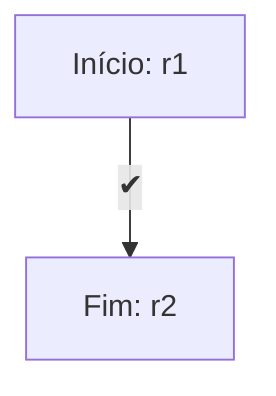
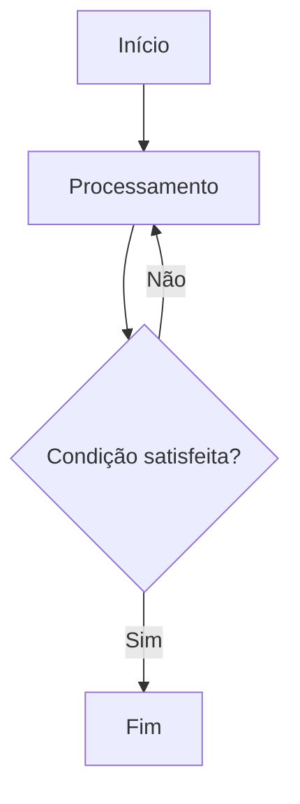
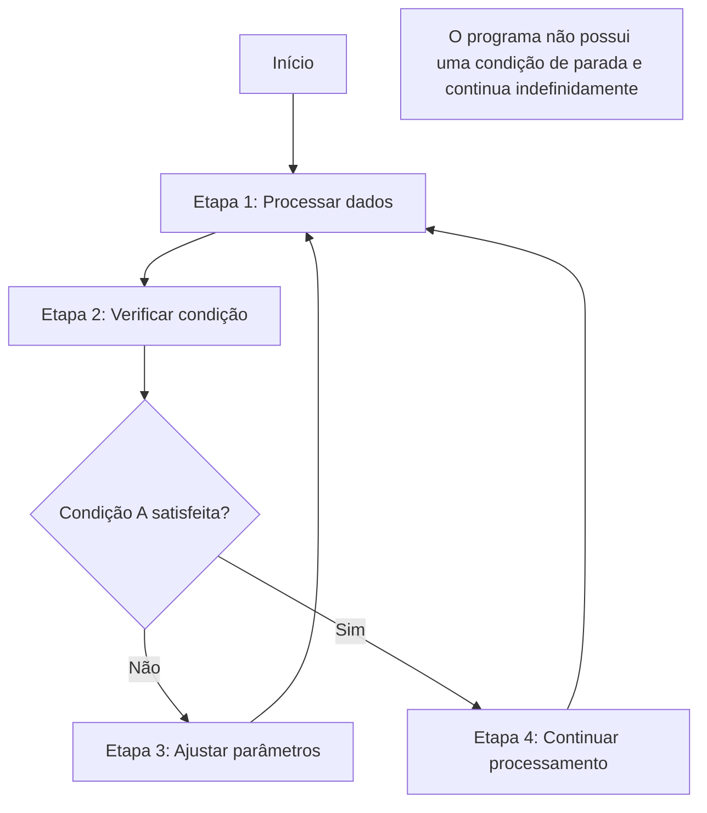

## 1. **Identificação e Comparação de Programas Monolítico, Iterativo e Recursivo em C**

**Programas em C:**

- **Monolítico**: Um programa monolítico é caracterizado por não dividir o código em funções, sendo todo o processamento realizado dentro de um único bloco. Exemplo:

```c
#include <stdio.h>

int main() {
    int i;
    for(i = 0; i < 5; i++) {
        printf("Número %d\n", i);
    }
    return 0;
}
```

- **Iterativo**: Usa estruturas de repetição para executar um conjunto de instruções várias vezes. Exemplo:

```c
#include <stdio.h>

int main() {
    int i = 0;
    while (i < 5) {
        printf("Número %d\n", i);
        i++;
    }
    return 0;
}
```

- **Recursivo**: O programa chama a si mesmo dentro da função, até atingir uma condição base. Exemplo:

```c
#include <stdio.h>

void contar(int n) {
    if (n >= 0) {
        printf("Número %d\n", n);
        contar(n - 1);
    }
}

int main() {
    contar(4);
    return 0;
}
```

## 2. **Desenho de Fluxogramas para os Programas**

- **a)** O fluxograma para o programa P2 onde se faz uma ação r1 e depois se vai para r2:
    
    - Começa em r1r_1, executa a ação associada, e então vai para r2r_2.



- **b)** Programa iterativo: Em um fluxo iterativo, um processo de repetição é apresentado, onde uma condição de parada é verificada em cada iteração. A estrutura de repetição pode ser desenhada de forma semelhante a um loop com uma condição de teste antes de cada repetição.




- **c)** Programa sem instrução de parada: Um fluxograma representando um programa sem instrução de parada pode ser um ciclo infinito onde uma condição de parada nunca existe.




Infelizmente, eu não consigo gerar fluxogramas diretamente, mas posso ajudar a criar um diagrama no seu software preferido (como o Lucidchart ou Draw.io).

## 3. **Programas Iterativos**

- **a)** A execução de `enquanto T faça V` pode não executar V se a condição T for **falsa** na primeira verificação, ou se a condição nunca for satisfeita.

- **b)** A operação vazia ✔ é considerada um programa iterativo porque não altera o estado do sistema e pode ser considerada uma operação que executa "de forma infinita", o que é característico dos programas iterativos que podem ser executados indefinidamente sem causar alteração.


## 4. **Computação vs Função Computada**

- **Computação**: Refere-se ao processo de realizar um conjunto de operações para resolver um problema ou calcular uma função, geralmente de maneira sequencial ou iterativa.
    
- **Função Computada**: É o resultado de um processo computacional. Uma função é computada por meio de um algoritmo ou máquina, e o resultado dessa computação é a **função computada**.
    

## 5. **Função Computada por um Programa em uma Máquina com Funções Parciais**

Quando uma máquina utiliza **funções parciais** (operações ou testes não definidos para todas as entradas), a função computada por um programa PP é também uma **função parcial**. Para uma entrada xx:

1. P(x)P(x) retorna yy, caso o programa termine após um número finito de passos.
2. P(x)P(x) é **indefinida** se:
    - O programa acessa uma operação ou teste fora do domínio de definição.
    - O programa entra em um laço infinito.

Formalmente:

\[ F(x) = \begin{cases} y, & \text{se \( P(x) \) termina com saída \( y \)} \\ \text{indefinida}, & \text{caso contrário.} \end{cases} \]

Essa definição reflete o comportamento da máquina, considerando a possibilidade de operações ou execuções **não terminarem** devido às limitações das funções parciais.

## 6. **Tradução de Fluxograma de Programa Monolítico para Iterativo**


#### Tradução do Fluxograma para Programa Iterativo

```python
# Início do programa
while True:  # Laço principal que verifica a condição de continuidade
    if T():  # Verifica condição T
        if not F():  # Verifica condição F caso T seja verdadeira
            break  # Sai do laço principal caso F seja falsa
    else:
        break  # Sai do laço principal caso T seja falsa

# Programa finalizado
````


## 7. **Verificação de Equivalência Forte de Programas**

### Programa P1

Estrutura:

- `até T faça (enquanto T faça (F; G); G)`:
    - Repetição de FF e GG enquanto TT for verdadeiro.
    - Executa GG uma vez ao final.

### Programa P2

Estrutura:

- RR e SS definidos por:
    - RR: Se TT, executa SS. Caso contrário, faz nada (✔✔).
    - SS: Se TT, executa F;GF; G e chama SS novamente. Caso contrário, executa GG e chama RR.

### Verificação:

- **Enquanto TT for verdadeiro**:
    - Ambos os programas executam FF e GG repetidamente.
- **Quando TT for falso**:
    - Ambos executam GG uma última vez.

### Conclusão:

**Os programas são fortemente equivalentes**, com diferenças apenas na implementação (iterativa vs recursiva).
