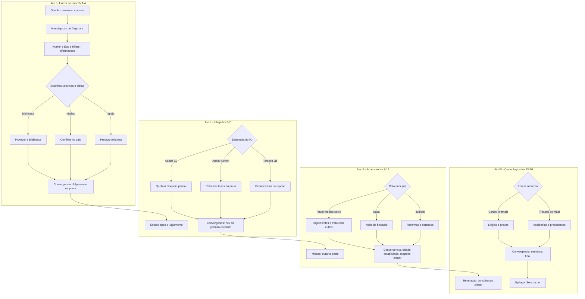

# Guia de Campanha — Yllmourne em Lhodos (Seguidor de Maal)

> **Formato:** campanha solo (PJ) + **DMPC** opcional de suporte. **Níveis:** 1–20. **Tom geral:** horror urbano → intriga política → heróico → cosmológico/religioso. **Cidade-base:** Yllmourne (porto caótico) inserida em **Lhodos**.

---

## Sumário rápido

- **Pitch:** um seguidor de **Maal** busca justiça numa cidade tomada por peste, naufrágios e máfias rivais. Aos poucos, descobre uma conspiração religiosa que escala de tribunal local a **litígios planares**.
    
- **Pilares:** ambiguidade moral da fé, justiça vs. ordem, promessas e contratos, memória/verdade, corrupção e cura.
    
- **Ferramentas:** marcos por nível (milestones), **clocks de facção**, set‑pieces de cais/porto, julgamentos públicos, acordos perigosos, viagens planares tardias.
    

---

## Fluxograma da Campanha

> **Leitura:** o fluxo prevê retornos. Eventos de **horror** podem ecoar até o fim (navios, peste), e decisões na intriga reescrevem quem é aliado no Ato IV.

---

## Marcos por Ato

### Ato I — Horror no cais (Níveis 1–4)

- **Tom:** investigação, sobrevivência, paranoia; neblina, lampiões, corpos na maré.
    
- **Objetivos do PJ:** provar que justiça ≠ linchamento; achar a causa da peste; mapear poder real da cidade.
    
- **Marcos:**
    
    - (N2) Pistas fortes sobre assassinato da curandeira Dagmara.
        
    - (N3) Enfrentar a cena do **navio em chamas** e salvar alguém-chave.
        
    - (N4) Primeira visita a **Hilbre** (território de Sefton) OU vitória social no **Kraken’s Egg**.
        
- **Risco temático:** se o PJ for duro demais, reforça os linchadores; se for brando, facções pisam nele. **Dê consequências visíveis.**
    

### Ato II — Intriga política (Níveis 5–7)

- **Tom:** jogo de influência; corrupção legalizada; conflitos de culto.
    
- **Objetivos do PJ:** manter a Biblioteca viva; defasar extorsões no porto; arbitrar alianças temporárias.
    
- **Marcos:**
    
    - (N5) Impedir o confisco/queima da Biblioteca.
        
    - (N6) Expor que a prelada local age sob **influência/hex** (sem reduzi‑la a vilã rasa).
        
    - (N7) **Julgamento público**: absolver bode expiatório e fazer inimigos em ambos os lados.
        

### Ato III — Ascensão do herói (Níveis 8–12)

- **Tom:** reformas e resgate; confrontos de médio porte; o nome do PJ circula.
    
- **Objetivos do PJ:** curar a peste (substituto de Dagmara), quebrar a cadeia de corrupção, estabilizar o porto sob lei justa.
    
- **Marcos:**
    
    - (N9) Reconhecido como **Talesman/Agente de Maal** (título em jogo).
        
    - (N10–11) Rival principal (Cy ou Sefton) é neutralizado (queda, acordo ou conversão).
        
    - (N12) Descoberta do **agente planar** por trás dos naufrágios/contratos.
        

### Ato IV — Cosmologia & fé (Níveis 13–20)

- **Tom:** contratos cósmicos, cortes extraplanares, tentação vs. justiça.
    
- **Objetivos do PJ:** encerrar a conspiração, conquistar precedente divino em favor de Yllmourne, selar o porto sob a Lei.
    
- **Marcos:**
    
    - (N15) Viagem a cortes infernais/etérias para obter prova/contrato.
        
    - (N17–18) **Audiência no Alto Tribunal de Maal** (trial‑by‑ordeal, advogados celestiais, testemunhas espectrais).
        
    - (N20) **Bênção final**: torna‑se Mão de Maal / Boon épico.
        

---

## Módulos & Inspirações por Fase

> Use como “caixa de ferramentas”; adapte nomes para Lhodos.

### Níveis 1–4 — Horror Urbano

- **Set‑piece de abertura:** "Navio em chamas" (salvamento, fuga, quebra‑cabeça de pólvora/âncoras).
    
- **Microinvestigações:** assassinato da curandeira; desaparecidos do cais; baralhos marcados no Kraken’s Egg.
    
- **One‑shots encaixáveis:** becos malditos, galpão de contrabandistas, hospital de campanha tomado por pânico.
    

### Níveis 5–7 — Intriga

- **Biblioteca vs. Constabulária:** infiltração, debate público, resgate de catálogo proscrito.
    
- **Hilbre:** parlamento com Sefton; corrida de barcos; campo minado submerso.
    
- **Julgamento público:** use mecânica de **debate/retórica** (testes encadeados; verdade x consequência social).
    

### Níveis 8–12 — Heróico

- **Curar a peste:** ritual médico‑sacro; negociação com culto costeiro; buscar ingredientes em cavernas costeiras.
    
- **Reformas do porto:** sindicato de estivadores; ruptura com atravessadores; eleição/plebiscito improvisado.
    
- **Clímax local:** “Noite do Bloqueio” — quebrar o cerco marítimo com audácia legal e naval.
    

### Níveis 13–20 — Cosmológico

- **Cortes infernais/afins:** litígios, contratos, cláusulas; duelos de prova com campeões.
    
- **Tribunal de Maal:** precedente divino para proteger Yllmourne (e Lhodos) de exploração planar.
    
- **Finale:** sentença, selos e reforma religiosa na cidade.
    

---

## Aventuras Intercaladas (Reservatório)

- **Rumores do cais (d6):**
    
    1. "O farol pisca padrões que atraem navios para os arrecifes".
        
    2. Um **cofre de maré** aparece a cada lua cheia — e sempre some com um nome riscado.
        
    3. Um padre coleta **dízimos de indenização** por "pecados de aposta".
        
    4. Na Biblioteca, livros trocam de prateleira quando ninguém olha.
        
    5. Crianças vendem amuletos contra "a língua da lama" (peste) — alguns funcionam.
        
    6. A taverna de Hilbre serve vinho que lembra a pessoa que você traiu.
        
- **Complicações (d6):**
    
    1. Greve no estaleiro.
        
    2. Chuva ácida derruba lampiões.
        
    3. Testemunha chave é analfabeta (precisa de encenação para narrar fatos).
        
    4. Contrabandistas usam sinos submersos para se comunicar.
        
    5. O prefeito tenta comprar o PJ com cargo.
        
    6. Um pacto antigo do porto é cobrado esta noite.
        

---

## NPCs Importantes (cartões rápidos)

> Campos: **Função • Traços • Objetivo • Segredo • Alavanca • Aparência/voz • Quer do PJ**

- **One‑Eyed Cy**, senhor do cais/contrabando.
    
    - Função: rival de Sefton; controla pescas e jogos.
        
    - Objetivo: manter monopólio e sobreviver à peste.
        
    - Segredo: o "olho" vê dívidas/culpas; está apodrecendo.
        
    - Quer do PJ: quebre o bloqueio de Hilbre ou limpe seu nome.
        
- **Sefton Bane**, senhora da **Ilha de Hilbre**.
    
    - Função: estrategista, controla o acesso marítimo.
        
    - Objetivo: porto "civilizado" sob sua disciplina.
        
    - Segredo: pacto com força de maré (não necessariamente maligna).
        
    - Quer do PJ: negociação legítima que reconheça seu domínio.
        
- **Faylene Chicarian**, prelada/"octante" da Igreja.
    
    - Função: rosto religioso; oscilando entre zelo e compaixão.
        
    - Segredo: sob influência (hex) de patrono externo; culpa‑se por medidas duras.
        
    - Quer do PJ: prova que permita corrigir o rumo sem ruína pública.
        
- **Minqena Yorusi**, bibliotecária‑chefe (gnômica).
    
    - Função: guardiã da memória; fonte de pistas.
        
    - Segredo: parte do acervo é vivo.
        
    - Quer do PJ: proteção e um estatuto legal para a Biblioteca.
        
- **Myles Lockton**, prefeito.
    
    - Função: fachada legal; medroso.
        
    - Segredo: desvio de fundos para comprar paz com as máfias.
        
    - Quer do PJ: que o "salve" de um escândalo.
        
- **Bartleby (capitão)** & **Elvie (crupiê)** — subtrama de dívida/vingança no Kraken’s Egg.
    

> **DM Tip:** Mantenha **3 frases** claras por NPC: **o que quer / como reage / o que teme**.

---

## Locais Relevantes

- **Kraken’s Egg (taverna/jogos):** rumores, truques, informantes.
    
- **Biblioteca de Yllmourne:** conhecimento proscrito; foco de intriga.
    
- **Ilha de Hilbre / Seafarers’ Rest:** neutralidade armada; parlamentos tensos.
    
- **Prefeitura & porões:** autópsias clandestinas, arquivos públicos.
    
- **Farol e arrecifes:** mensagens codificadas; naufrágios.
    
- **Canais subterrâneos / grutas de maré:** rituais de cura; bestiário anfíbio.
    
- **Templos da Grande Igreja (ala rotarista):** sermões, tribunais, caridade e zelo.
    
- **Tribunal de Maal (plano tardio):** epicentro do Ato IV.
    

---

## Clocks de Facção (0–6)

- **Peste da Lama:** 0 Calmaria → 3 Hospitais lotados → 6 Colapso civil.
    
- **Guerra Cy × Sefton:** 0 Trégua → 3 Escaramuças → 6 Bloqueio total.
    
- **Inquérito contra a Biblioteca:** 0 Suspeita → 3 Confisco → 6 Auto de queima.
    
- **Influência/Hex sobre Faylene:** 0 Dúvidas → 3 Discursos extremos → 6 Decreto tirânico.
    
- **Bloqueio marítimo:** 0 Livre → 3 Pedágios → 6 Fome & motins.
    

> **Avanço de clock:** sempre que o PJ falhar com **ruído** ou ignorar uma frente por 1–2 sessões.

---

## Ajustes para Campanha Solo

- **DMPC** (opcional):
    
    - **Perfil:** _Perito/Escriba‑jurista_ (sidekick Expert) — perícias sociais, investigação, ferramentas de escriba e ladrão.
        
    - **Funções:** abrir caminhos sociais; segurar luta em ação de ajuda; registrar provas.
        
    - **Evolução:** vira coadjuvante no Ato III; pode advogar no Ato IV.
        
- **Encontros:** reduzir número de inimigos; usar **Relógios de Ameaça** e **falhas parciais**; oferecer itens de **controle/informação** (frascos de verdade, lanternas do nevoeiro, selo de Maal).
    

---

## Ambiguidade Religiosa (arcos)

- **Lei vs. Misericórdia:** Maal exige devido processo; a cidade pede respostas rápidas.
    
- **Culpa & Contratos:** quem assina paga? cláusulas escondidas, promessas públicas.
    
- **Verdade & Memória:** Biblioteca como santuário; livros vivos; depoimentos duvidosos.
    

**Prompts de dilema:**

1. Queimar um foco de peste salva dezenas, mas destrói a casa de inocentes.
    
2. Um contrato sujo mantém o porto abastecido no inverno — rompe‑lo pode matar de fome.
    
3. A prelada em transe assina um decreto injusto. Revogar em segredo ou expor publicamente?
    

---

## Plano de Recompensas (sem "chuva" de ouro)

- **Boons de Maal:** selo que detecta mentira 1/dia; audiência sumária 1/long rest; visão das provas.
    
- **Tesouros temáticos:** grimórios legais, marretas de estaleiro santificadas, lanterna que mostra sangue nas tábuas.
    
- **Títulos:** Defensor da Biblioteca; Mediador da Baía; Talesman de Maal; Mão de Maal.
    

---

## Integração com Lhodos

- **Mapa:** posicione Yllmourne como porto satélite na **Baía de Uldor** (entrada secundária), atraindo refugiados e oportunistas.
    
- **Forças externas:** espiões de **Karlasgard** e **Merrane** alimentam Cy/Sefton para desestabilizar o rival.
    
- **Panteão:** alinhe a ala rotarista como facção dentro da **Grande Igreja**; Maal mantém cortes autônomas.
    
- **Planos:** _Naran_ (conspiração/teias) e/ou _Thellos_ (decadência/prazer) como bastidores dos naufrágios/pestes; Ato IV leva ao **Alto Tribunal de Maal**.
    

---

## Estrutura de Sessão (Template)

**Sessão X — Título**

- **Estado dos Clocks:** Peste __/6 · Cy×Sefton __/6 · Biblioteca __/6 · Hex __/6 · Bloqueio __/6
    
- **Objetivo do PJ:** __
    
- **Ganchos & Rumores:** __
    
- **Cenas:** 1) __ 2) __ 3) __ 4) __
    
- **Pistas (3 fortes / 3 fracas):** __
    
- **Complicações / Relógios que avançam:** __
    
- **Recompensas & Consequências:** __
    
- **Próximos passos:** __
    

---

## Roteiro das Primeiras 6 Sessões (esqueleto)

1. **Galeão em Chamas** — salvar, investigar, decidir destino do casco.
    
2. **Autópsia & Porões** — pistas de veneno/ritual; primeira escolha pública.
    
3. **Kraken’s Egg** — dívidas, jogos marcados, subtrama Bartleby/Elvie.
    
4. **Biblioteca em Risco** — proteger acervo; paradeiro de catálogo proscrito.
    
5. **Hilbre** — parlamento com Sefton; mapa do bloqueio; quem ganha se o caos continuar?
    
6. **Julgamento na Praça** — absolver bode expiatório; cortar uma engrenagem da extorsão.
    

---

## Conjuntos de Encontros (por nível)

- **N1–2:** bandidos de cais, enxames anfíbios, fogo e pânico (testes ambientais).
    
- **N3–4:** matilhas de capangas, cultistas do nevoeiro, quebra‑cabeça de docas.
    
- **N5–7:** agentes da constabulária corrupta, advogados brutais, sabotagem naval.
    
- **N8–10:** campeões das máfias, constructos de estaleiro, rituais de cura contestados.
    
- **N11–13:** emissários planares, farsantes sagrados, cerco marítimo.
    
- **N14–20:** juízes celestiais, arquidiabos legistas, provas metafísicas.
    

---

## Apêndice A — Quadro de NPCs (preenchível)

|Nome|Papel|Vínculo com PJ|Desejo|Segredo|Alavanca|
|---|---|---|---|---|---|
|||||||
|||||||

---

## Apêndice B — Quadro de Locais (preenchível)

|Local|Tipo|Quem manda|Ganchos|Perigos|Recompensas|
|---|---|---|---|---|---|
|||||||
|||||||

---

## Apêndice C — Relógios de Projeto (preenchível)

- **Peste:** [ ] [ ] [ ] [ ] [ ] [ ]
    
- **Cy×Sefton:** [ ] [ ] [ ] [ ] [ ] [ ]
    
- **Biblioteca:** [ ] [ ] [ ] [ ] [ ] [ ]
    
- **Hex:** [ ] [ ] [ ] [ ] [ ] [ ]
    
- **Bloqueio:** [ ] [ ] [ ] [ ] [ ] [ ]
    

---

## Apêndice D — DMPC Sidekick (modelo rápido)

**Nome:** __  
**Tipo:** _Expert (Escriba-jurista)_  
**Pontos fortes:** Investigação, Persuasão, Ferramentas de ladrão, Kit de escriba  
**Talentos úteis:** Ajuda tática, Vantagem em colheita de pistas, Registro fiel de depoimentos  
**Arco:** amadurece de escudeiro a advogado do Ato IV.

---

### Notas Finais

- **Ritmo:** manter sessões com 3–4 cenas fortes; sempre uma escolha moral.
    
- **Ambiente:** chame o mar; neblina, sinos, tábuas molhadas, marulhos que respondem.
    
- **Regra de ouro:** _todo avanço político exige prova; toda prova tem um custo._