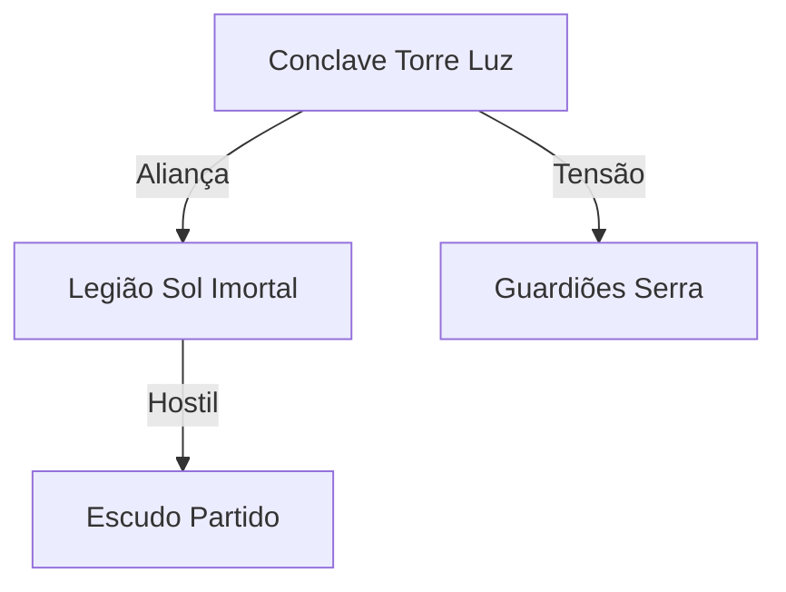

# Roteiro de Continuação - Desenvolvimento das Facções de Lhodos

**Data de Criação:** 2025-01-26
**Contexto:** Este documento permite continuar o desenvolvimento das 19 facções de Lhodos usando outras ferramentas de IA quando o limite de contexto da sessão atual for atingido.

---

## Status Atual (Checkpoint)

### ✅ BLOCO 1 - FACÇÕES RELIGIOSAS (COMPLETO)
1. **Conclave da Torre da Luz** — 9.2/10 ✓
2. **Círculo da Lua Velada** — 8.7/10 ✓
3. **Ordo Nyxarae** — 7.8/10 ✓
4. **Ordem dos Tocados** — 7.8/10 ✓
5. **Vozes da Última Porta** — 8.9/10 ✓
6. **Guardiões da Serra Silenciosa** — 8.7/10 ✓ (REVISADO com sucesso)

**Média BLOCO 1:** 8.52/10 — Excelente

### ⏳ BLOCO 2 - FACÇÕES MILITARES (EM PROGRESSO)
7. **Legião do Sol Imortal** — EM PROGRESSO (~50% completo)
   - ✅ Fundação detalhada (7 fundadores, Cerco de Bastião 287 EdL)
   - ✅ Marcos históricos (7 eventos mostrando evolução moral)
   - ✅ Estrutura organizacional (Alto Comando, 15.000 soldados)
   - ✅ Poder único com mecânicas (Benção do Mandato Solar)
   - ✅ 2 NPCs completos (Theron Lança-Dourada, Kael Escudo-Quebrado)
   - ⏳ FALTA: Vertentes internas compactas, 3-4 ganchos prontos, relações com outras facções, aventura completa

8. **Vigias do Crepúsculo** — PENDENTE
9. **Legião do Escudo Partido** — PENDENTE

### ⏳ BLOCOS 3-7 - PENDENTES
- BLOCO 3: Facções Econômicas (4 facções)
- BLOCO 4: Facções Culturais (2 facções)
- BLOCO 5: Facções Naturais (2 facções)
- BLOCO 6: Facções Acadêmicas (2 facções)
- BLOCO 7: Documentos Consolidados (Index, Guia, Cronologia)

---

## PADRÃO DE QUALIDADE (Lições Aprendidas)

### Scores Alvo
- **Facções Secundárias:** 8.0+/10
- **Facções Principais:** 9.0+/10

### Elementos Obrigatórios de Cada Facção (600-900 linhas)

1. **Informações Rápidas** (tabela)
   - Fundação (ano EdL, local, evento)
   - Líderes atuais (nomes completos)
   - Tamanho estimado
   - Deidade principal (se aplicável)
   - Receita anual
   - Sede principal
   - Poder único
   - Conflito interno

2. **Origem com Fundadores Nomeados**
   - Evento fundador específico (não vago)
   - 5-9 fundadores com NOMES, classes, idades, motivações
   - Custo pessoal da fundação (mortes, sacrifícios)
   - Missão original vs função atual (mostrar evolução)

3. **Marcos Históricos (6-9 eventos)**
   - Datas específicas (EdL)
   - Eventos que mostram evolução moral da facção
   - Pelo menos 1 evento "problemático" (massacre, erro, corrupção)
   - Conexões com outras facções

4. **Estrutura Organizacional COMPACTA**
   - Liderança atual (2-3 figuras)
   - Composição numérica
   - Hierarquia clara mas não excessiva

5. **Poder Único com MECÂNICAS UTILIZÁVEIS**
   - Requisitos (tempo, materiais, custos)
   - Rolagens (d20, d100, etc.)
   - Modificadores claros
   - Limitações explícitas
   - Exemplo de uso na mesa

6. **NPCs Completos (2-3, não 4+)**
   - Raça/classe/idade/alinhamento
   - História pessoal (trauma, motivação, conflito)
   - Objetivos específicos
   - Estatísticas parciais (HP, AC, equipamento chave, 1 habilidade especial)
   - Gancho pronto para interação com PCs

7. **Vertentes Internas (MÁXIMO 2-3)**
   - Evitar template bloat (não criar 4-5 subfacções sempre)
   - Focar em DILEMA FILOSÓFICO central
   - Distinção clara mas não caricata

8. **Ganchos Prontos (3-4, não 7)**
   - Formato: Setup → Twist → Stakes
   - Session-ready (DM pode usar imediatamente)
   - Dilemas morais, não apenas combates

9. **Relações com Outras Facções (5-8 conexões)**
   - NPCs-ponte específicos (nomes, eventos concretos)
   - Conflitos ideológicos claros
   - Eventos históricos compartilhados (datas EdL)

10. **Aventura Completa (Nível X-Y)**
    - Premissa clara
    - 3 atos
    - Múltiplos finais possíveis
    - Consequências explícitas

### ❌ ERROS A EVITAR (Aprendidos com Revisões)

**1. Incoerência Filosófica (CRÍTICO)**
- **Problema:** Facção afirma X mas faz Y constantemente
- **Exemplo:** Guardiões "nunca intervêm" mas intervêm toda hora
- **Solução:** Criar **critérios objetivos de quando agir** (seção dedicada)

**2. Vaguidade Mecânica (HIGH)**
- **Problema:** Poder único descrito poeticamente, sem mecânicas
- **Exemplo:** "Leitura de Ciclos permite prever eventos" (como?)
- **Solução:** Tabelas d100, modificadores, custos, exemplos de uso

**3. Template Bloat (MEDIUM)**
- **Problema:** Sempre 4-5 subfacções, sempre mesma estrutura
- **Solução:** Reduzir para 2-3 vertentes FILOSÓFICAS. Outras funções são especializações técnicas, não facções.

**4. NPCs Formulaicos**
- **Problema:** Todos seguem padrão "trauma → extremismo"
- **Solução:** Variar arquétipos. Alguns podem ser gentis, alguns pragmáticos, alguns confusos moralmente.

**5. Ganchos em Excesso**
- **Problema:** 7 ganchos = nenhum memorável
- **Solução:** 3-4 ganchos ELITE, cada um com twist único

---

## PROMPT PARA CONTINUAR LEGIÃO DO SOL IMORTAL

**Contexto para IA:**
```
Você está continuando o desenvolvimento da facção "Legião do Sol Imortal" para campanha de D&D 5e em português brasileiro, ambientada em Lhodos (mundo custom).

ARQUIVO ATUAL:
C:\Users\Yanbd\dev\-Wiki-Yan\content\RPG\Lhodos\Facções\new\legiao_do_sol_imortal_faccao_de_lhodos.md

STATUS ATUAL (~50% completo, ~310 linhas):
✅ Seção 1: Origem e Razão de Ser (completa)
✅ Seção 2: Marcos Históricos (7 eventos, 287-1400 EdL)
✅ Seção 3: Estrutura e Organização
✅ Seção 4: Dogma e Poder Único (Benção do Mandato Solar com mecânicas)
✅ Seção 5: NPCs (Theron Lança-Dourada + Kael Escudo-Quebrado)
⏳ Seção 6: Atuação no Mundo (iniciada, linha 312)

PRÓXIMOS PASSOS (completar para ~700 linhas):
1. Finalizar Seção 6: Atuação no Mundo (economia, recursos, influência) — 50 linhas
2. Seção 7: Vertentes Internas (usar as 5 já esboçadas no arquivo original: Cruzados do Zênite, Escudos da Aurora, Lança Dourada, Capas Escarlates, Cálices Radiantes) — compactar para 150 linhas
3. Seção 8: Relações com Outras Facções (6 conexões: Conclave, Magos Rubros, Vigias Crepúsculo, Círculo Lua Velada, Vozes Última Porta, Guardiões Serra) — 100 linhas
4. Seção 9: Ganchos Prontos (3-4 ganchos com Setup→Twist→Stakes) — 120 linhas
5. Seção 10: Aventura Completa "O Rei que Nunca Morreu" (níveis 9-11, dilema sobre sucessão real) — 180 linhas

TEMA CENTRAL DA FACÇÃO:
"Salvadores que oprimem" — Legião genuinamente salvou reino em 287 EdL, mas 1100 anos depois tornou-se instrumento de controle autoritário. AINDA acredita servir justiça divina. Não são vilões caricatos.

PODER ÚNICO JÁ DEFINIDO:
Benção do Mandato Solar — bênção divina CONDICIONAL. Quebra se soldado duvida da ordem. Isso cria ciclo: questionar = perder proteção = morrer = obediência cega.

IMPORTANTE:
- Manter tom de "crentes sinceros fazendo mal"
- Evitar maniqueísmo (não são "puros vilões")
- Mostrar tensão interna (Cruzados fanáticos vs Escudos pragmáticos)
- NPCs com complexidade moral
```

**PROMPT ESPECÍFICO:**
```
Leia o arquivo atual da Legião do Sol Imortal. Continue a partir da linha 312 (Seção 6: Atuação no Mundo).

Complete as seções 6-10 seguindo o padrão de qualidade definido:
- Seção 6: Economia/recursos (compacta, 50 linhas)
- Seção 7: Vertentes internas (usar as 5 já esboçadas, compactar para 150 linhas totais)
- Seção 8: Relações com 6 facções (NPCs-ponte específicos, eventos históricos EdL)
- Seção 9: 3-4 ganchos prontos (Setup→Twist→Stakes, session-ready)
- Seção 10: Aventura "O Rei que Nunca Morreu" (níveis 9-11, sucessão real contestada, Legião dividida sobre quem apoiar, múltiplos finais)

Após completar, salve o arquivo e chame agente revisor dm-framework-reviewer para avaliar.

TARGET: 8.0+/10
```

---

## PROMPTS PARA FACÇÕES RESTANTES

### Vigias do Crepúsculo (2ª facção militar)

**Contexto para IA:**
```
Desenvolver "Vigias do Crepúsculo" — organização de espionagem/inteligência militar de Karlasgard.

ARQUIVO BASE: vigias_do_crepusculo_faccao_de_lhodos.md (se existir, caso contrário criar do zero)

CONCEITO CENTRAL:
"Honra através da desonra" — Vigias fazem trabalho sujo (espionagem, assassinato, sabotagem) para que Legião do Sol Imortal mantenha mãos limpas. São necessários mas desprezados.

DIFERENCIAL DA LEGIÃO:
- Legião = força aberta, glória pública, mandato divino
- Vigias = força oculta, vergonha necessária, mandato SECULAR (sem bênção divina)

PODER ÚNICO:
"Rede de Sussurros" — sistema de informantes em todo reino. Mecânicas: rolagem de Investigação + modificador por região, acesso a informações classificadas.

DILEMA MORAL:
Vigias SABEM que Legião comete atrocidades. Documentam tudo. Mas nunca expõem (lealdade ao reino > verdade). Alguns agentes começam a vazar segredos — traição ou justiça?

ESTRUTURA:
- Líder: Sombra-Mestre (identidade secreta, nem General-Solar sabe quem é)
- 3 Diretorias: Exterior (espionagem externa), Interior (contra-espionagem), Operações Negras (assassinatos)
- ~2.000 agentes ativos, 10.000+ informantes civis

MARCOS HISTÓRICOS:
- Fundação após descoberta de conspiração (agentes descobriram golpe contra rei)
- Pelo menos 1 evento onde Vigias "falharam" (massacre não previsto)
- Conflito com Círculo da Lua Velada (espionagem vs informação comercial)

TARGET: 8.0+/10, ~700 linhas
```

### Legião do Escudo Partido (3ª facção militar)

**Contexto para IA:**
```
Desenvolver "Legião do Escudo Partido" — exército de veteranos DESERTORES de outras facções militares (Legião Sol Imortal, Vigias, mercenários).

CONCEITO CENTRAL:
"Escudos que protegem aqueles de quem desertaram" — Legião formada por soldados que recusaram ordens imorais. Agora defendem civis contra próprios ex-comandos.

DIFERENCIAL:
- Não têm pátria fixa (nômades)
- Não cobram por proteção (vivem de doações voluntárias)
- Perseguidos como traidores, mas heroicos para população

PODER ÚNICO:
"Juramento Quebrado, Espírito Intacto" — Bônus moral contra antigas facções. Quando lutam contra ex-aliados, ganham +2 ataque mas sofrem dano psíquico (culpa).

FUNDAÇÃO:
Massacre do Portão Dourado (1.187 EdL, Legião Sol Imortal matou 400 civis). 50 soldados desertaram após massacres. Fundaram Escudo Partido.

ESTRUTURA:
- Sem líder formal (conselho rotativo de 7 veteranos)
- ~800 membros ativos, 3.000+ simpatizantes
- Bases móveis (acampamentos em florestas, ruínas)

DILEMA MORAL:
Quanto proteção é demais? Escudo Partido às vezes "protege" civis CONTRA vontade deles (paternalismo). Alguns querem paz, mas Escudo insiste em preparar para guerra.

TARGET: 8.0+/10, ~700 linhas
```

---

## PADRÃO DE TRABALHO PARA BLOCOS 3-6

### Cada Facção Segue Este Processo:

**PASSO 1: Leitura do Arquivo Base**
```
Ler arquivo existente (se houver) em:
C:\Users\Yanbd\dev\-Wiki-Yan\content\RPG\Lhodos\Facções\new\[nome_faccao].md

Analisar:
- Linhas atuais (geralmente ~150-200)
- Conceito básico já definido
- Lacunas (fundadores ausentes, sem mecânicas, etc.)
```

**PASSO 2: Expansão (Alvo ~700 linhas)**
```
Adicionar seções obrigatórias:
1. Informações Rápidas (tabela)
2. Origem com 5-9 fundadores nomeados
3. Marcos históricos (6-9 eventos EdL)
4. Estrutura organizacional (compacta)
5. Poder único com mecânicas
6. 2-3 NPCs completos
7. 2-3 vertentes internas (não 4-5)
8. 3-4 ganchos prontos
9. Relações com 5-8 outras facções
10. Aventura completa

Seguir padrão de qualidade (veja seção acima).
```

**PASSO 3: Revisão com Agente**
```
Chamar dm-framework-reviewer com prompt:

"Avaliar [NOME DA FACÇÃO] seguindo critérios:
- Worldbuilding (coesão interna, lore)
- Utilidade na mesa (NPCs, ganchos, mecânicas)
- Originalidade (evitar template)
- Coesão Narrativa (filosofia consistente)

Target: 8.0+/10 para facções secundárias, 9.0+/10 para principais.

Identificar:
- Incoerência filosófica
- Vaguidade mecânica
- Template bloat
- NPCs formulaicos

Fornecer score e fixes específicos."
```

**PASSO 4: Correções (se score < 8.0)**
```
Implementar fixes do revisor:
- Prioridade 1 (CRITICAL): Incoerências filosóficas
- Prioridade 2 (HIGH): Mecânicas vagas
- Prioridade 3 (MEDIUM): Template bloat

Re-submeter ao revisor até atingir 8.0+.
```

---

## BLOCOS 3-6: FACÇÕES PENDENTES

### BLOCO 3 - FACÇÕES ECONÔMICAS

**10. Aliança das Caravanas de Uldor**
- **Conceito:** Guildas mercantes unificadas, controlam comércio terrestre
- **Poder Único:** Rede Comercial (desconto em equipamentos, acesso a itens raros)
- **Dilema:** Lucro vs ética (vendem para todos, inclusive tiranos)
- **Arquivo:** `alianca_caravanas_uldor_faccao_de_lhodos.md`

**11. Caminhantes das Marés**
- **Conceito:** Marinheiros, piratas e comerciantes marítimos
- **Poder Único:** Navegação Abençoada (Maal protege em mares)
- **Dilema:** Liberdade vs pirataria (linha tênue)
- **Arquivo:** `caminhantes_mares_faccao_de_lhodos.md`

**12. Confraria do Sol Interior**
- **Conceito:** Artesãos, ferreiros, construtores (adoradores de Maal)
- **Poder Único:** Forja Consagrada (itens mágicos bentos por Maal)
- **Dilema:** Perfeccionismo vs produtividade
- **Arquivo:** `confraria_sol_interior_faccao_de_lhodos.md`

**13. Casa dos Sorrisos Dourados**
- **Conceito:** Banqueiros, cambistas, agiotas (adoradores de Darmon - deus ganância)
- **Poder Único:** Contrato Vinculante (dívida mágica obrigatória)
- **Dilema:** Riqueza legítima vs exploração
- **Arquivo:** `casa_sorrisos_dourados_faccao_de_lhodos.md`

### BLOCO 4 - FACÇÕES CULTURAIS

**14. Liga das Mil Liras**
- **Conceito:** Bardos, músicos, contadores de histórias
- **Poder Único:** Canção da Memória Verdadeira (impede falsificação histórica)
- **Dilema:** Verdade histórica vs narrativas confortáveis
- **Arquivo:** `liga_mil_liras_faccao_de_lhodos.md`

**15. Lareiras de Anwyn**
- **Conceito:** Curandeiros, parteiras, hospedeiros (adoradores de Anwyn - deusa lar)
- **Poder Único:** Santuário Inviolável (ninguém pode violentar dentro de Lareira)
- **Dilema:** Neutralidade absoluta (curam todos, inclusive vilões)
- **Arquivo:** `lareiras_anwyn_faccao_de_lhodos.md`

### BLOCO 5 - FACÇÕES NATURAIS

**16. Filhos de Eliwyn**
- **Conceito:** Druidas, rangers, protetores de florestas
- **Poder Único:** Chamado da Floresta (animais e plantas obedecem)
- **Dilema:** Preservação vs desenvolvimento civilizacional
- **Arquivo:** `filhos_eliwyn_faccao_de_lhodos.md`

**17. Irmandade do Fogo Manso**
- **Conceito:** Monges, ascetas, controladores de fúria (adoradores de Korak)
- **Poder Único:** Fúria Controlada (rage sem perder controle)
- **Dilema:** Suprimir emoções vs aceitá-las
- **Arquivo:** `irmandade_fogo_manso_faccao_de_lhodos.md`

### BLOCO 6 - FACÇÕES ACADÊMICAS

**18. Colegiado de Tinel**
- **Conceito:** Magos, sábios, bibliotecários (adoradores de Tinel - deus magia)
- **Poder Único:** Biblioteca Infinita (acesso a qualquer conhecimento não-proibido)
- **Dilema:** Conhecimento livre vs conhecimento perigoso
- **Arquivo:** `colegiado_tinel_faccao_de_lhodos.md`

**19. Filhos da Centelha Quebrada**
- **Conceito:** Inventores, artificers, tecnomantes (adoradores de Tinel, facção radical)
- **Poder Único:** Magitech (fundem magia + tecnologia)
- **Dilema:** Progresso vs tradição (Colegiado os vê como hereges)
- **Arquivo:** `filhos_centelha_quebrada_faccao_de_lhodos.md`

---

## BLOCO 7 - DOCUMENTOS CONSOLIDADOS

### 20. Index.md - Lista Mestra

**Prompt:**
```
Criar arquivo index.md em:
C:\Users\Yanbd\dev\-Wiki-Yan\content\RPG\Lhodos\Facções\index.md

Conteúdo:
# Facções de Lhodos

## Visão Geral
[Parágrafo introdutório sobre sistema de facções]

## BLOCO 1 - Facções Religiosas
1. [Conclave da Torre da Luz](new/conclave_torre_luz_faccao_de_lhodos.md) — 9.2/10
   - **Conceito:** Igreja oficial de Rodu, controla ortodoxia religiosa
   - **Líder:** Grande Sacerdote Erastos
   - **Poder:** Excomunhão Divina

[... repetir para todas 19 facções ...]

## Tabela Comparativa

| Facção | Bloco | Score | Tamanho | Orçamento | Conceito |
|--------|-------|-------|---------|-----------|----------|
| Conclave | 1 | 9.2 | 5.000 | 1.2M PO | Igreja oficial |
[... completar tabela ...]

## Mapa de Relações
[Diagrama textual mostrando alianças/conflitos entre facções]

## Cronologia Consolidada
[Linha do tempo com eventos-chave de todas facções, 0-1400 EdL]
```

### 21. Guia Consolidado

**Prompt:**
```
Criar "Guia Consolidado das Facções de Lhodos" em:
C:\Users\Yanbd\dev\-Wiki-Yan\content\RPG\Lhodos\Facções\guia_consolidado_faccoes.md

Estrutura:
1. Introdução ao Sistema de Facções
2. Como Usar Facções na Mesa
3. Tabela de Decisão Rápida (que facção usar para cada tipo de aventura)
4. NPCs-Ponte (personagens que aparecem em múltiplas facções)
5. Eventos Históricos Compartilhados (cronologia integrada)
6. Conflitos Maiores (guerras, tratados, alianças que envolvem múltiplas facções)
7. Ganchos de Campanha (aventuras que conectam várias facções)
8. Apêndice: Glossário de Deuses, Locais, Termos
```

### 22. Documentos de Apoio

**a) Cronologia Integrada (cronologia_faccoes.md):**
```
Linha do tempo visual com TODOS os eventos das 19 facções, organizados por século:

SÉCULO 1 (0-100 EdL)
- 50-100 EdL: Fundação Guardiões Serra Silenciosa

SÉCULO 3 (200-300 EdL)
- 287 EdL: Fundação Legião Sol Imortal (Cerco de Bastião)
- 287 EdL: Vozes Última Porta fundadas (Peste dos Sem-Nome)

[... continuar até 1400 EdL ...]
```

**b) Mapa de Relações (mapa_relacoes_faccoes.md):**
```
Diagrama textual (ou Mermaid.js) mostrando:
- Alianças (setas verdes)
- Conflitos (setas vermelhas)
- Cooperação pragmática (setas amarelas)
- NPCs-Ponte (nós conectando facções)

Exemplo formato Mermaid:

```

**c) Tabela de NPCs-Ponte (npcs_ponte.md):**
```
Lista NPCs que aparecem em múltiplas facções:

1. **Eldrin Memória-Perfeita** (Cronista-Mor)
   - Facção Principal: Vozes da Última Porta
   - Aparições: Guardiões Serra (visitou Biblioteca 3x), Colegiado Tinel (troca conhecimento)
   - Função: Ponte entre conhecimento mortuário e histórico

[... listar todos NPCs-Ponte ...]
```

---

## WORKFLOW RECOMENDADO

### Ordem Sugerida de Desenvolvimento:

**Prioridade ALTA (completar primeiro):**
1. Finalizar Legião Sol Imortal (50% feito)
2. Vigias do Crepúsculo (complementa Legião)
3. Legião Escudo Partido (contraste moral com Legião)

**Prioridade MÉDIA:**
4. Facções Econômicas (BLOCO 3) — essenciais para worldbuilding funcional
5. Filhos de Eliwyn (referenciado em várias facções existentes)

**Prioridade BAIXA:**
6. Facções Culturais e Acadêmicas (menos integradas com facções atuais)
7. Documentos consolidados (fazer APÓS todas facções individuais prontas)

---

## CHECKLIST DE FINALIZAÇÃO

### Para Cada Facção:
- [ ] Score ≥ 8.0/10 (revisor aprovou)
- [ ] Arquivo tem 600-900 linhas
- [ ] Possui 10 seções obrigatórias
- [ ] Poder único tem mecânicas utilizáveis
- [ ] Pelo menos 1 evento "problemático" nos marcos históricos
- [ ] NPCs têm conflito moral (não são arquetipos puros)
- [ ] Ganchos têm Stakes claros (não apenas "investiguem isso")
- [ ] Relações com outras facções incluem NPCs-ponte e datas EdL

### Para Documentos Consolidados:
- [ ] Index.md referencia todas 19 facções
- [ ] Guia Consolidado tem exemplos práticos de uso
- [ ] Cronologia integrada sem contradições de datas
- [ ] Mapa de relações visualmente claro

---

## ESTIMATIVA DE TEMPO

**Com IA eficiente (Claude Sonnet, GPT-4):**
- Completar Legião Sol Imortal: 30-45min
- Cada facção nova (Vigias, Escudo, etc.): 60-90min cada
- Total BLOCO 2: ~4 horas
- Total BLOCOS 3-6: ~15 horas (13 facções × ~70min)
- Documentos consolidados: ~3 horas
- **TOTAL ESTIMADO: 22-25 horas de trabalho efetivo**

**Dicas para Otimização:**
1. Usar sessões longas (não fragmentar demais)
2. Fazer facções de mesmo bloco em sequência (mantém contexto)
3. Revisor identifica padrões — fixes ficam mais rápidos após 3-4 facções
4. Documentos consolidados são mecânicos (copiar/colar organizado)

---

## CONTATO E SUPORTE

**Se Tiver Dúvidas:**
1. Releia esta seção: [referência específica]
2. Consulte facções completas como referência (Guardiões Serra, Vozes Última Porta)
3. Use revisor dm-framework-reviewer liberalmente (ele aprende e melhora feedback)

**Arquivos de Referência (Padrão Ouro):**
- `guardioes_da_serra_silenciosa_faccao_de_lhodos.md` — 8.7/10 (melhor exemplo técnico)
- `vozes_da_ultima_porta_faccao_de_lhodos.md` — 8.9/10 (melhor storytelling)
- `conclave_torre_luz_faccao_de_lhodos.md` — 9.2/10 (facção principal elite)

---

## NOTAS FINAIS

Este roteiro foi criado em **2025-01-26** após completar 6 facções religiosas e iniciar facções militares. Representa aprendizado iterativo através de 6 ciclos desenvolvimento+revisão.

**Padrão de qualidade validado:**
- Média BLOCO 1: 8.52/10
- Guardiões melhorou de 7.3 → 8.7 após revisão focada
- Mecânicas utilizáveis são CRÍTICAS (não basta descrever, precisa implementar)
- Filosofia coerente > originalidade forçada

**Boa sorte!** 🎲

---

**Changelog:**
- 2025-01-26: Criação inicial (6 facções completas, Legião 50%)
