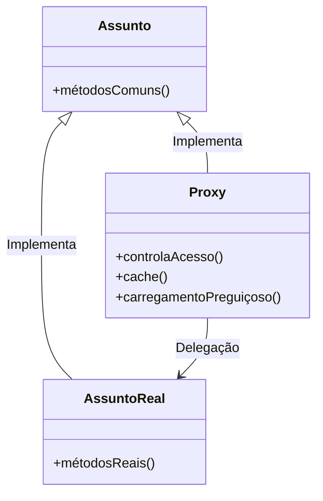

> [!quote] Fortune favors the brave.
> — Virgil


### Padrão Proxy

#### Problema que o Padrão Visa Resolver

O padrão Proxy é utilizado para gerenciar e controlar o acesso a objetos que podem ser caros ou complexos para criar e manipular diretamente. Ele ajuda a introduzir um intermediário que pode adicionar funcionalidades como verificação de permissões, otimização de desempenho ou controle de instância. Isso é particularmente importante quando o objeto real é sensível, demanda muito tempo para inicializar ou precisa de controle de acesso rigoroso.

#### Forma como o Padrão Resolve o Problema

O Proxy serve como um intermediário entre o cliente e o objeto real. Ele implementa a mesma interface que o objeto real, permitindo que o cliente interaja com o Proxy de forma transparente. O Proxy pode adicionar funcionalidades como:

- **Acesso Controlado**: Implementa segurança e autorização para acessar o objeto real.
- **Carregamento Sob Demanda**: Inicializa o objeto real apenas quando necessário, economizando recursos.
- **Otimização de Desempenho**: Armazena em cache dados frequentemente acessados para melhorar a eficiência.

Essa abordagem permite que o Proxy controle e modifique as interações com o objeto real sem alterar o código do cliente que o utiliza.

### Estrutura Geral do Padrão Proxy

- **Subject (Assunto)**: Define a interface que o Proxy e o RealSubject devem implementar, garantindo que ambos possam ser utilizados de maneira intercambiável. No nosso exemplo, essa interface é representada pela classe `Imagem`, que define o método `mostrar`.
    
- **RealSubject (Assunto Real)**: É o objeto que possui a lógica principal e pode ser caro para criar ou manipular. Em nosso exemplo, a classe `ImagemReal` representa o objeto real que lida com o carregamento e exibição da imagem. O carregamento da imagem é um processo que pode ser custoso.
    
- **Proxy (Proxy)**: Implementa a mesma interface que o Subject e mantém uma referência ao RealSubject. Ele adiciona lógica adicional antes ou depois da chamada ao RealSubject. No exemplo, a classe `ImagemProxy` age como um intermediário que adia a criação do `ImagemReal` até que seja realmente necessário, economizando recursos.
    

### Aplicações do Padrão Proxy

O padrão Proxy pode ser aplicado de várias maneiras, dependendo da necessidade:

- **Proxy Virtual**: Utilizado para adiar a criação de um objeto até que ele seja realmente necessário. Ideal para objetos grandes ou complexos. No nosso exemplo, `ImagemProxy` é um Proxy Virtual que adia o carregamento da `ImagemReal` até que o método `mostrar` seja chamado pela primeira vez.
    
- **Proxy Remoto**: Representa um objeto que está localizado em um ambiente diferente, como em uma máquina remota. Facilita a comunicação entre clientes e objetos distribuídos. Não aplicável diretamente ao exemplo de imagens, mas útil em sistemas distribuídos.
    
- **Proxy de Proteção**: Implementa controles de acesso para garantir que apenas usuários autorizados possam interagir com o objeto real. Embora não usado no exemplo, é frequentemente empregado em cenários onde o acesso aos recursos precisa ser restrito.
    
- **Proxy de Cache**: Armazena resultados de operações dispendiosas para evitar a repetição de cálculos ou carregamentos. No exemplo de imagens, a classe `ImagemProxy` pode ser adaptada para armazenar em cache a imagem carregada, evitando reprocessamento em chamadas subsequentes.
    

_Comentário sobre motivação da escolha:_ A escolha do padrão Proxy para este exemplo reflete a necessidade de otimizar o carregamento e gerenciamento de recursos. Em contextos como a edição de mídia, o conceito de proxies é familiar e aplicado para permitir o uso de versões reduzidas de arquivos pesados, facilitando o fluxo de trabalho e melhorando a performance. O padrão Proxy oferece uma técnica eficiente para controlar e otimizar o acesso a recursos complexos.

## Diagrama UML



### Explicação da Implementação

1. **Definição de Classes**:
    
    - **Assunto (Subject)**: Define a interface comum para os objetos que irão implementar o padrão Proxy. Esta classe é uma abstração que especifica os métodos que tanto o **Assunto Real** quanto o **Proxy** terão em comum.
    - **Assunto Real (RealSubject)**: Esta classe contém a implementação concreta dos métodos definidos na interface **Assunto**. É o objeto real que o **Proxy** representa e delega chamadas para.
    - **Proxy**: Implementa a mesma interface do **Assunto** e atua como um intermediário. O **Proxy** pode adicionar funcionalidades como controle de acesso, cache e carregamento preguiçoso, além de delegar chamadas ao **Assunto Real**.
2. **Relações**:
    
    - **Assunto <|-- Assunto Real**: Esta relação indica que o **Assunto Real** implementa a interface **Assunto**. O **Assunto Real** deve fornecer a implementação concreta dos métodos definidos na interface **Assunto**.
    - **Assunto <|-- Proxy**: Mostra que o **Proxy** também implementa a interface **Assunto**. Isso permite que o **Proxy** e o **Assunto Real** sejam tratados de maneira intercambiável pelos clientes.
    - **Proxy --> Assunto Real**: Esta relação indica que o **Proxy** delega chamadas ao **Assunto Real**. O **Proxy** pode adicionar lógica adicional antes ou depois de delegar a chamada ao **Assunto Real**.


##### Código em Python
```
from abc import ABC, abstractmethod

# Interface comum para o Assunto Real e o Proxy
class Imagem(ABC):
    @abstractmethod
    def mostrar(self):
        pass

# Classe RealSubject
class ImagemReal(Imagem):
    def __init__(self, arquivo: str):
        self._arquivo = arquivo
        self._carregar()

    def _carregar(self):
        # Simula o carregamento de uma imagem, que pode ser um processo pesado
        print(f"Carregando imagem: {self._arquivo}")

    def mostrar(self):
        print(f"Mostrando imagem: {self._arquivo}")

# Classe Proxy
class ImagemProxy(Imagem):
    def __init__(self, arquivo: str):
        self._arquivo = arquivo
        self._imagem_real = None

    def mostrar(self):
        if self._imagem_real is None:
            # Carregamento preguiçoso
            self._imagem_real = ImagemReal(self._arquivo)
        self._imagem_real.mostrar()
```


### Explicação do Código

1. **Interface Imagem (Assunto)**:
    
    - Define o método `mostrar` que tanto o **ImagemReal** quanto o **ImagemProxy** devem implementar.
2. **ImagemReal (Assunto Real)**:
    
    - Simula o carregamento de uma imagem e sua exibição. O carregamento é realizado no momento da criação do objeto, o que pode ser um processo custoso.
3. **ImagemProxy (Proxy)**:
    
    - Mantém uma referência ao **ImagemReal** e adia o carregamento da imagem até que o método `mostrar` seja chamado pela primeira vez. Esse comportamento é conhecido como **carregamento preguiçoso**.
4. **Exemplo de Uso**:
    
    - Demonstra como o **ImagemProxy** carrega a imagem somente quando necessário, economizando recursos e tempo.

Este exemplo ilustra como o padrão Proxy pode ser usado para otimizar o carregamento e gerenciamento de recursos, especialmente quando se lida com operações caras ou demoradas. O Proxy permite adiar o trabalho pesado até que seja realmente necessário, oferecendo uma maneira eficiente e controlada de acessar recursos pesados.