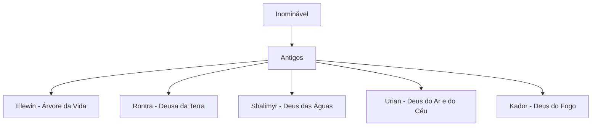
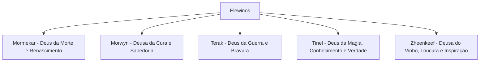
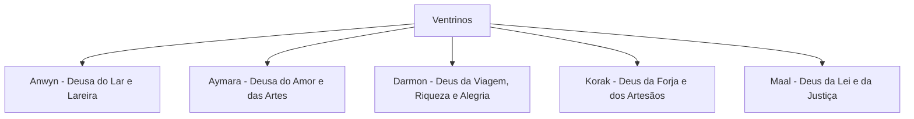
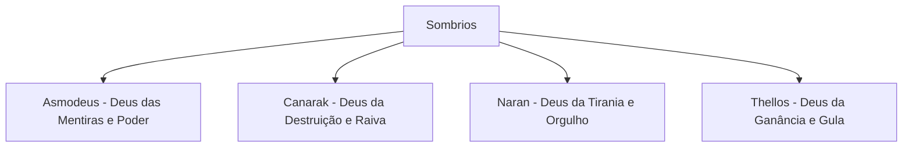
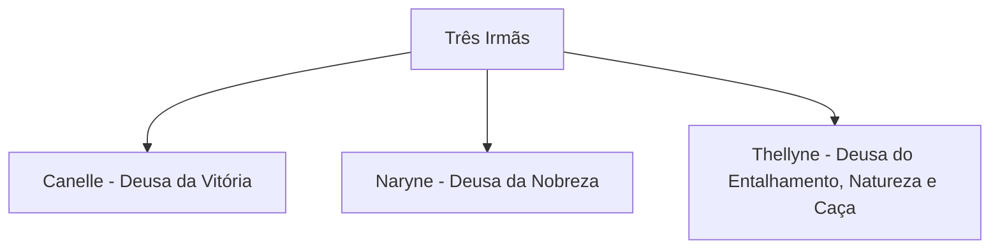

> [!quote] "Estamos presos à tecnologia quando o que realmente queremos é apenas coisas que funcionem."
> — Douglas Adams

# Notas Yan Braga

Bem-vindo ao repositório de minhas anotações! Aqui, você encontrará informações sobre meus interesses e projetos, organizados nas seguintes seções:

## 📚 RPG

Explore o mundo de Lhodos e conheça os elementos chave do meu universo RPG.

- **[[RPG/Deuses/index|Deuses]]**: Seres fantásticos e poderosos, baseados na mitologia do *Book of the Righteous*.
	- [[Um Tratado Sobre o Divino]]: Epopeia do Grande Sábio Matalou sobre a criação do mundo e o toque dos deuses sobre ele.
	Aqui está uma árvore com as divindades colocadas segundo ‘hierarquia’, ou seja, geração de divindades
	
- **[[RPG/Facções/index|Facções]]**: Grupos importantes, desde a Liga dos Aventureiros até cultistas antagonistas.
- **[[RPG/Heróis/Heróis|Heróis]]**: Lendas e figuras heroicas que refletem os valores culturais e divinos.
- **[[RPG/NPCs/index|NPCs]]**: Personagens recorrentes que enriquecem as histórias e aventuras.
- [[RPG/Regras/index|Regras]]: Regras alternativas ou complementares para as mesas de RPG, muitas vezes para todas as vezes, algumas em apenas algumas é aceito (consulte o narrador)

## 💻 Desenvolvimento

Referências e conhecimentos técnicos voltados para áreas específicas de T.I.

- **[[Dev - Computação/Docker/index|Docker]]**: Guia completo sobre Docker, desde a instalação até técnicas avançadas.
- **[[Dev - Computação/Syncthing/index|Syncthing]]**: Tutoriais e dicas para a sincronização eficiente de arquivos.
- **[[Dev - Computação/Outros]]**: Outras ferramentas e tecnologias úteis para desenvolvedores.

---