> [!quote] "Estamos presos à tecnologia quando o que realmente queremos é apenas coisas que funcionem."
> — Douglas Adams

# Notas Yan Braga

Bem-vindo ao repositório de minhas anotações! Aqui, você encontrará informações sobre meus interesses e projetos, organizados nas seguintes seções:

## 📚 RPG

Explore o mundo de Lhodos e conheça os elementos chave do meu universo RPG.

- **[[RPG/Deuses/index|Deuses]]**: Seres fantásticos e poderosos, baseados na mitologia do *Book of the Righteous*.
	- [[Um Tratado Sobre o Divino]]: Epopeia do Grande Sábio Matalou sobre a criação do mundo e o toque dos deuses sobre ele.
	Aqui está uma árvore com as divindades colocadas segundo ‘hierarquia’, ou seja, geração de divindades
	
- **[[RPG/Facções/index|Facções]]**: Grupos importantes, desde a Liga dos Aventureiros até cultistas antagonistas.
- **[[RPG/Heróis/Heróis|Heróis]]**: Lendas e figuras heroicas que refletem os valores culturais e divinos.
- **[[RPG/NPCs/index|NPCs]]**: Personagens recorrentes que enriquecem as histórias e aventuras.
- [[RPG/Regras/index|Regras]]: Regras alternativas ou complementares para as mesas de RPG, muitas vezes para todas as vezes, algumas em apenas algumas é aceito (consulte o narrador)

```mermaid
graph TD
    A[Inominável] --> B[Antigos]
    B --> Elewin[Elewin - Árvore da Vida] 
    B --> IRontra[Rontra - Deusa da Terra]
    B --> Shalimyr[Shalimyr - Deus das Águas]
    B --> Urian[Urian - Deus do Ar e do Céu]
    B --> Kador[Kador - Deus do Fogo]

```

```mermaid
graph TD
    A[Elewinos]
    A --> Mormekar[Mormekar - Deus da Morte e Renascimento]
    A --> Morwyn[Morwyn - Deusa da Cura e Sabedoria]
    A --> Terak[Terak - Deus da Guerra e Bravura]
    A --> Tinel[Tinel - Deus da Magia, Conhecimento e Verdade]
    A --> Zheenkeef[Zheenkeef - Deusa do Vinho, Loucura e Inspiração]

```

```mermaid
graph TD
    A[Ventrinos]
    A --> Anwyn[Anwyn - Deusa do Lar e Lareira]
    A --> Aymara[Aymara - Deusa do Amor e das Artes]
    A --> Darmon[Darmon - Deus da Viagem, Riqueza e Alegria]
    A --> Korak[Korak - Deus da Forja e dos Artesãos]
    A --> Maal[Maal - Deus da Lei e da Justiça]

```

```mermaid
graph TD
    A[Sombrios]
    A --> Asmodeus[Asmodeus - Deus das Mentiras e Poder]
    A --> Canarak[Canarak - Deus da Destruição e Raiva]
    A --> Naran[Naran - Deus da Tirania e Orgulho]
    A --> Thellos[Thellos - Deus da Ganância e Gula]


```

```mermaid
graph TD
    A[Três Irmãs]
    A --> Canelle[Canelle - Deusa da Vitória]
    A --> Naryne[Naryne - Deusa da Nobreza]
    A --> Thellyne[Thellyne - Deusa do Entalhamento, Natureza e Caça]


```

## 💻 Desenvolvimento

Referências e conhecimentos técnicos voltados para áreas específicas de T.I.

- **[[Dev - Computação/Docker/index|Docker]]**: Guia completo sobre Docker, desde a instalação até técnicas avançadas.
- **[[Dev - Computação/Syncthing/index|Syncthing]]**: Tutoriais e dicas para a sincronização eficiente de arquivos.
- **[[Dev - Computação/Outros]]**: Outras ferramentas e tecnologias úteis para desenvolvedores.

---